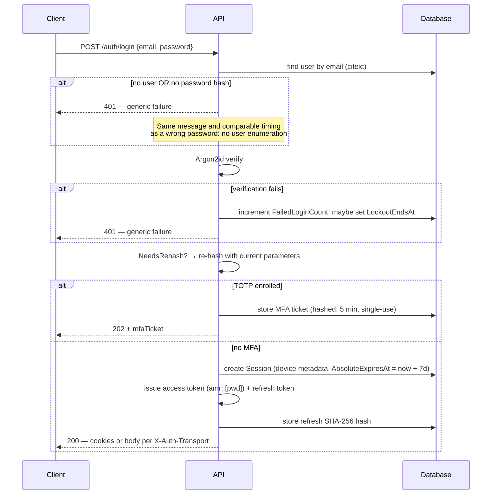
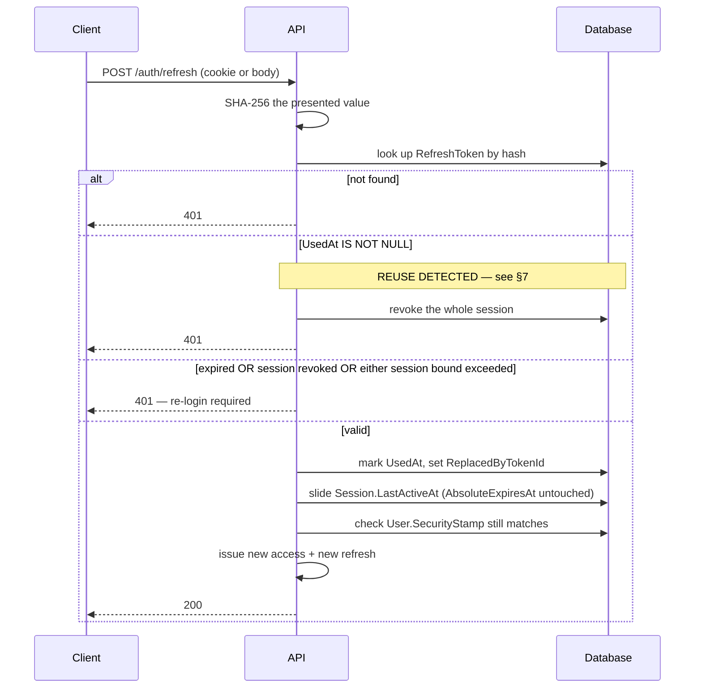
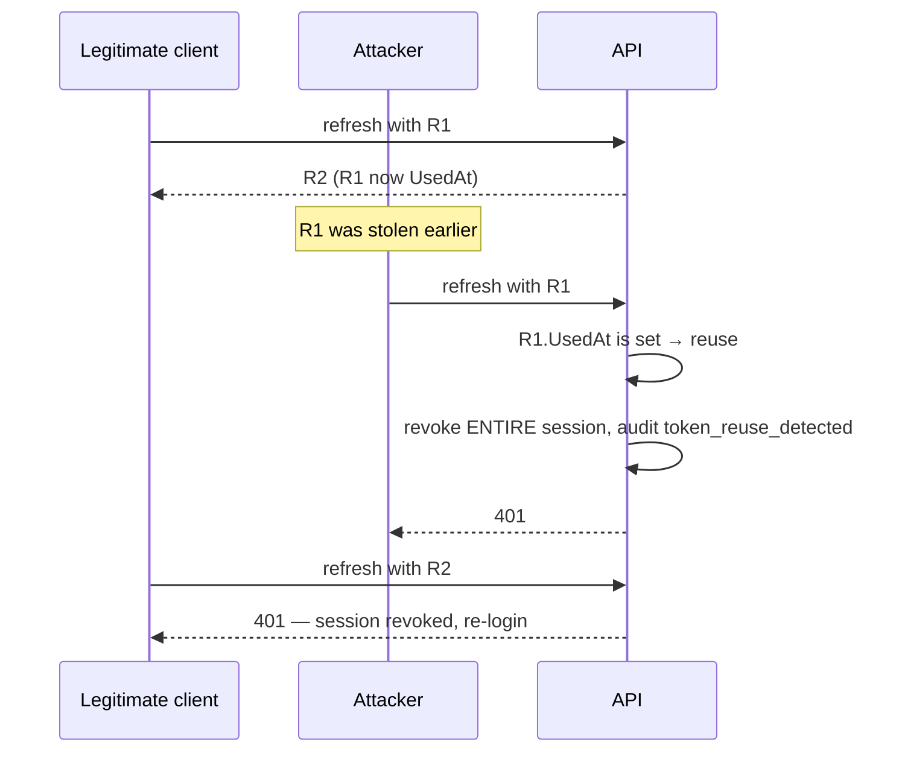
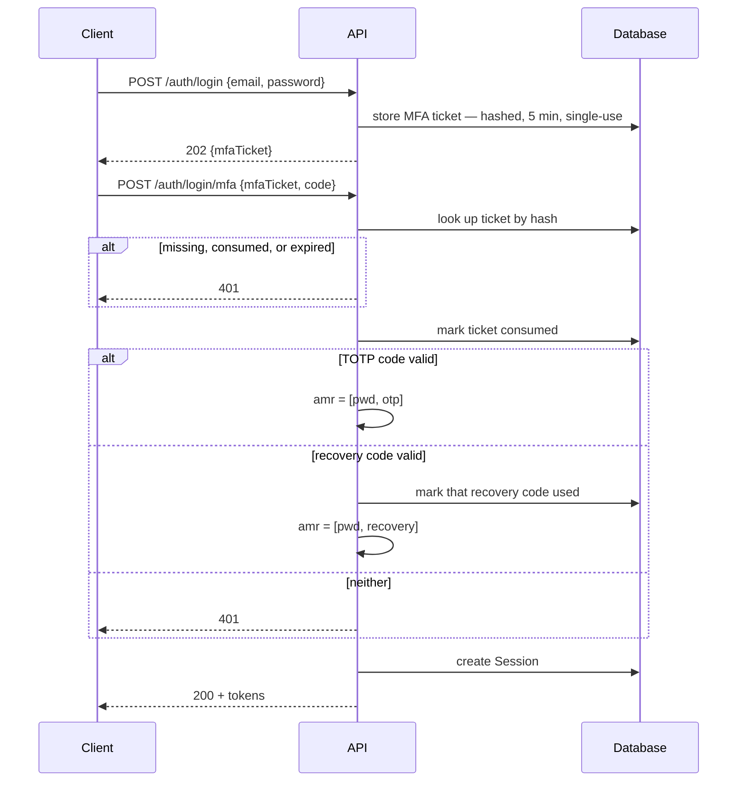
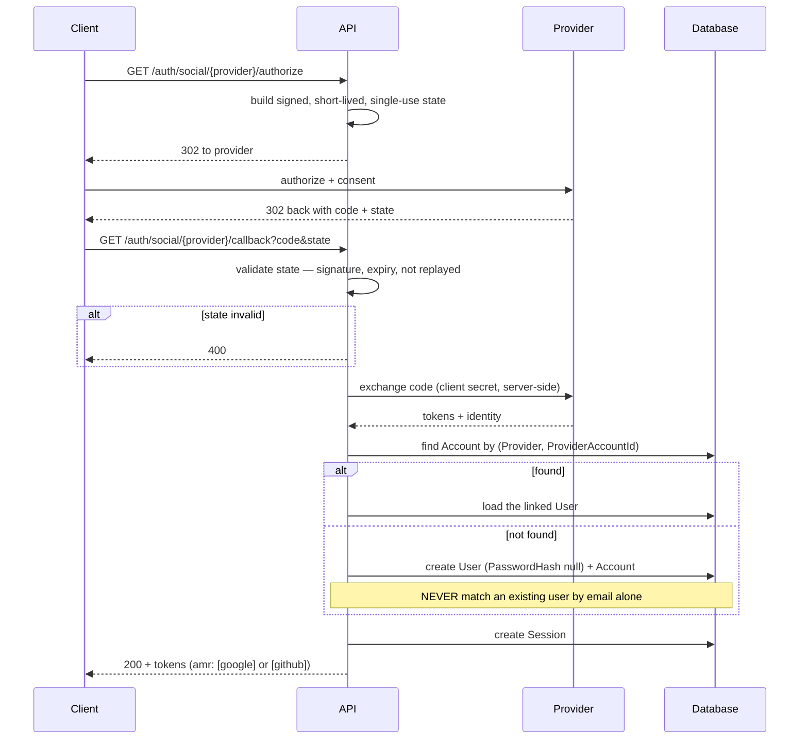
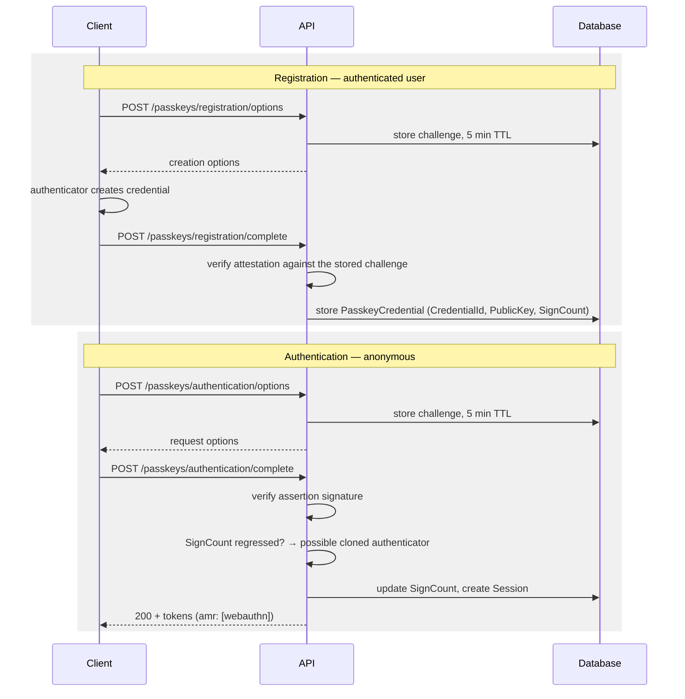
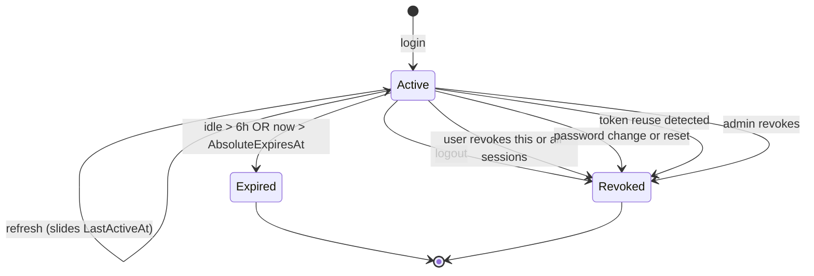
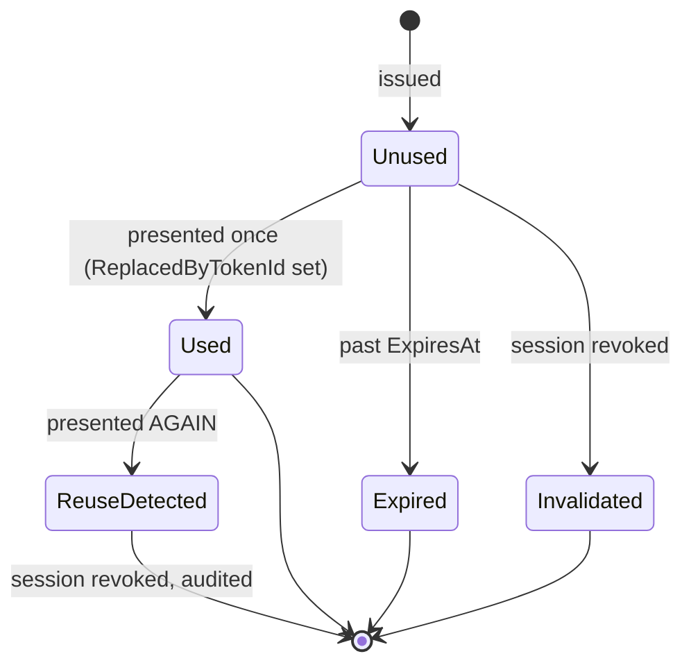

# Authentication and Token Architecture

**Status:** Approved 2026-07-22 · **Workstream:** §4 · **Implemented by:** §6 (entities), §12 (services)

The complete token lifecycle — issuance, validation, rotation, reuse detection, revocation, key rotation, and transport. This document is the single source of truth for how authentication works; endpoint documentation (§19) links here rather than restating it.

Decisions this document implements: [ADR-0001](../Decisions/ADR-0001-token-strategy.md) (token strategy), [ADR-0002](../Decisions/ADR-0002-session-lifetime-and-model.md) (session lifetime), [ADR-0003](../Decisions/ADR-0003-token-transport.md) (transport), [ADR-0004](../Decisions/ADR-0004-signing-key-management.md) (key ring), [ADR-0006](../Decisions/ADR-0006-password-hashing.md) (hashing), [ADR-0019](../Decisions/ADR-0019-social-login.md) (social), [ADR-0020](../Decisions/ADR-0020-signing-key-storage.md) (key storage).

---

## 1. The two credentials

| | Access token | Refresh token |
|---|---|---|
| Format | JWT, ES256 | 256-bit CSPRNG, opaque |
| Lifetime | **15 minutes** | Bounded by its session |
| Storage at rest | Not stored | **SHA-256 hash only** |
| Validation | Stateless, against JWKS | Database lookup by hash |
| Revocable immediately | **No** — bounded by TTL | Yes |
| Reuse | Freely, until expiry | **Single-use** |

The asymmetry is the design. Access tokens are cheap to validate and therefore cannot be revoked; refresh tokens are revocable and therefore cost a database round-trip. The 15-minute TTL is the revocation-lag bound, not a tuning knob.

---

## 2. Access-token claims

| Claim | Value | Notes |
|---|---|---|
| `iss` | configured issuer | Validated strictly |
| `aud` | configured audience | Validated strictly |
| `sub` | user id (GUID) | |
| `sid` | session id (GUID) | Ties the token to one session row |
| `jti` | token id (GUID) | Audit correlation |
| `iat` / `exp` | issued / expiry | 15-minute span |
| `email_verified` | bool | Gates flows that require a verified address |
| `roles` | string array | Source for policy-based authorization (§5) |
| `amr` | array: `pwd`, `otp`, `webauthn`, `recovery`, `google`, `github` | **How** this session authenticated |
| `token_use` | `access` | Rejects a refresh token presented as a bearer token |

**Validation is pinned:** `alg` must be `ES256`. The algorithm is never read from the token header to select a validation strategy — that is the algorithm-substitution vulnerability, and §22 tests `alg: none` and substituted-algorithm tokens as explicit negative cases.

**Clock skew: 30 seconds.** Configured in `JwtOptions.ClockSkew`, applied to `exp` and `nbf`. It is deliberately small: the default 5 minutes would extend every access token's effective life by a third.

---

## 3. Transport

Client selects with `X-Auth-Transport: cookie|body` on login. Default `body`. **The server never issues tokens in both places at once** ([ADR-0003](../Decisions/ADR-0003-token-transport.md)).

### Cookie matrix

| Cookie | Contents | `httpOnly` | `Secure` | `SameSite` | `Path` |
|---|---|---|---|---|---|
| `__Host-auth.access` | access token | ✅ | ✅ | `Lax` | `/` |
| `__Secure-auth.refresh` | refresh token | ✅ | ✅ | **`Strict`** | `/api/v1/auth/refresh` |
| `__Host-auth.csrf` | CSRF token | ❌ *(by design)* | ✅ | `Lax` | `/` |

The refresh cookie cannot use `__Host-` because that prefix requires `Path=/`, which would defeat the path scoping. Path scoping won: the browser then never attaches the refresh token to any request other than a refresh.

The CSRF cookie is deliberately readable — double-submit requires JavaScript to copy it into `X-CSRF-Token`.

### CSRF

Cookie mode only. `GET /api/v1/auth/csrf` sets the CSRF cookie; every state-changing request **authenticated by cookie** must echo it in `X-CSRF-Token`. The filter **exempts bearer-authenticated requests** — they carry no ambient credential and are not reachable by CSRF.

> Getting this exemption wrong in the permissive direction (exempting everything) silently disables CSRF protection across the API. §22 asserts the filter fires for cookie-authenticated state-changing requests.

---

## 4. Session lifetime

Two bounds, **both** of which must hold ([ADR-0002](../Decisions/ADR-0002-session-lifetime-and-model.md)):

```text
now < LastActiveAt + 6 hours        sliding inactivity window
AND
now < AbsoluteExpiresAt             login time + 7 days, written once
```

A successful refresh slides `LastActiveAt`. **It never extends `AbsoluteExpiresAt`** — implementations must not "helpfully" extend it, which would silently defeat the cap.

The two failure modes are distinguishable in the response so a client can tell "you were idle" from "your session aged out".

---

## 5. Login



Password verification is deliberately slow ([ADR-0006](../Decisions/ADR-0006-password-hashing.md)), which makes login both attacker-facing and expensive. It gets its own rate-limit bucket (§17) rather than sharing a general one.

---

## 6. Refresh and rotation



`SecurityStamp` is checked **here, not per request**. That preserves stateless access-token validation while still giving a global per-user kill switch that takes effect within one access-token lifetime.

---

## 7. Reuse detection

An already-used refresh token means one of two things: an attacker is replaying a stolen token, or the legitimate client retried. Neither can be distinguished, so the safe reading is assumed.



**The whole session is revoked, not just the token.** The legitimate user is forced to re-authenticate and the event is audited. That is loud by design: an attacker silently coexisting on a live session is a far worse outcome than a user re-logging in.

---

## 8. MFA challenge



The ticket is a credential in its own right: hashed at rest, single-use, 5-minute TTL, and stored as a `VerificationToken` of type `MfaChallenge`. It authorises exactly one thing — completing this login.

---

## 9. Social callback

Google and GitHub, API-driven redirect ([ADR-0019](../Decisions/ADR-0019-social-login.md)).



**Provider asymmetry:** Google is OIDC and asserts a verified email, so `EmailVerified` may be set from it. GitHub is OAuth 2.0 only — its email comes from a separate call and carries no verification guarantee, so a GitHub login **does not** set `EmailVerified` unless that response marks the address verified *and* primary.

---

## 10. Passkey ceremonies



Challenges are single-use and server-side. A non-increasing `SignCount` is the WebAuthn cloned-authenticator signal — it is audited, and §22 covers it.

---

## 11. State machines

### Session



`RevocationReason` is recorded on every transition into `Revoked` — it is what makes an audit trail answerable after the fact.

### RefreshToken



Used tokens are **retained**, not deleted — a deleted token is indistinguishable from one that never existed, and reuse detection depends on telling those apart. Cleanup happens only after the parent session is well past its absolute expiry (§12 background worker).

---

## 12. Signing keys

Ring of `SigningKey` rows, ES256, private material protected by Data Protection ([ADR-0020](../Decisions/ADR-0020-signing-key-storage.md)).

| State | Signs | Validates | In JWKS |
|---|---|---|---|
| `Active` | ✅ | ✅ | ✅ |
| `Retiring` | ❌ | ✅ | ✅ |
| `Retired` | ❌ | ❌ | ❌ |

**Rotation:** generate a new `Active` → demote the previous to `Retiring` → wait **at least access TTL + clock skew (15 min + 30 s)** → mark `Retired`.

Retiring a key earlier than that invalidates tokens still legitimately in flight. The runbook (§27) states the minimum wait explicitly rather than leaving it to judgement.

---

## 13. Global revocation paths

| Trigger | Effect |
|---|---|
| Logout | Current session revoked |
| Revoke one session | That session revoked |
| Revoke all | All sessions except current |
| Password change **or** reset | `SecurityStamp` bumped, **all** sessions revoked |
| Token reuse detected | That session revoked, audited |
| Admin revokes user sessions | All sessions for that user |

In every case the access token already issued stays cryptographically valid until its `exp` — at most 15 minutes. That is the accepted, bounded cost of stateless validation.

---

## 14. API keys

Format `ak_<prefix>_<secret>`. The prefix is stored in plaintext for O(1) lookup; the secret is Argon2id-hashed with a **deliberately cheap profile** — API keys are high-entropy machine-generated secrets, not human-chosen passwords, so they are not dictionary-attackable and do not need a slow hash.

That fast profile must never be applied to user passwords. The two profiles are separately named configuration, and §22 asserts the password path uses the slow one.

Authenticated by a dedicated `ApiKeyAuthenticationHandler` scheme. Scopes map to the permission constants (§5). API keys do **not** create sessions and do **not** participate in refresh.

---

## 15. Security properties this design depends on

1. Refresh tokens are never stored in plaintext — a database compromise yields no usable token.
2. Reuse detection revokes the session, not just the token.
3. `alg` is pinned to ES256; the token header never selects the validation strategy.
4. `SameSite=Strict` plus path scoping keeps the refresh cookie off every request but the refresh.
5. MFA tickets, WebAuthn challenges, and verification tokens are all single-use, hashed, and short-lived.
6. `SecurityStamp` is a per-user kill switch independent of token TTLs.
7. Login failures are indistinguishable between "no such user" and "wrong password", in both message and timing.
8. Private signing keys are never logged, never serialised into a response, and never appear in a Problem Details payload.

§22 must map every attack in its negative-test list to one of these.

---

## 16. Interfaces and options

Defined in this workstream, implemented in §12:

| Type | Responsibility |
|---|---|
| `IAccessTokenIssuer` | Mint and sign a JWT for a session |
| `IRefreshTokenService` | Issue, rotate, detect reuse, revoke |
| `ISessionService` | Create, validate against both bounds, revoke |
| `ISigningKeyManager` | Active key, JWKS projection, rotation |
| `IMfaTicketService` | Issue and consume MFA challenge tickets |

| Options | Covers |
|---|---|
| `JwtOptions` | issuer, audience, 15-min TTL, 30-s skew, `ES256` |
| `SessionOptions` | 6-h sliding window, 7-day absolute cap, cleanup interval |
| `AuthCookieOptions` | the cookie matrix in §3 |

All three are validated at startup (§25). A misconfigured cookie policy or an unset issuer must fail the process at boot, not produce a subtly insecure runtime.

> Named `AuthCookieOptions`, not `CookieOptions` as the roadmap wrote it — `Microsoft.AspNetCore.Http.CookieOptions` already exists and is in scope through implicit usings, so the roadmap's name would collide on every file that touches both.
