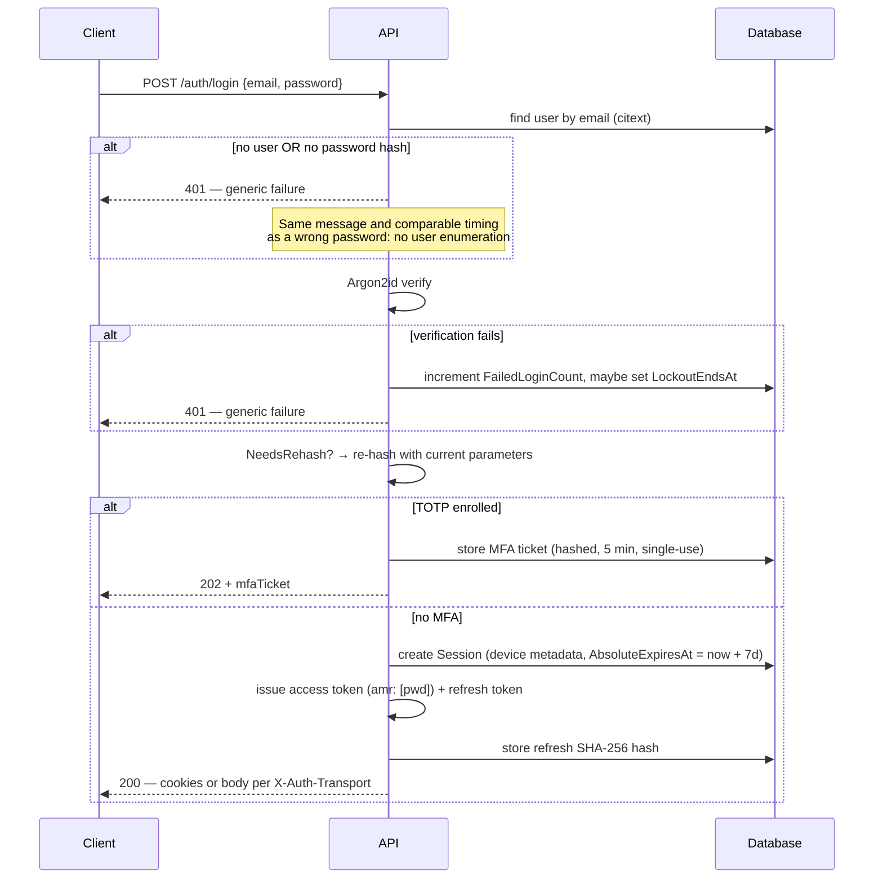
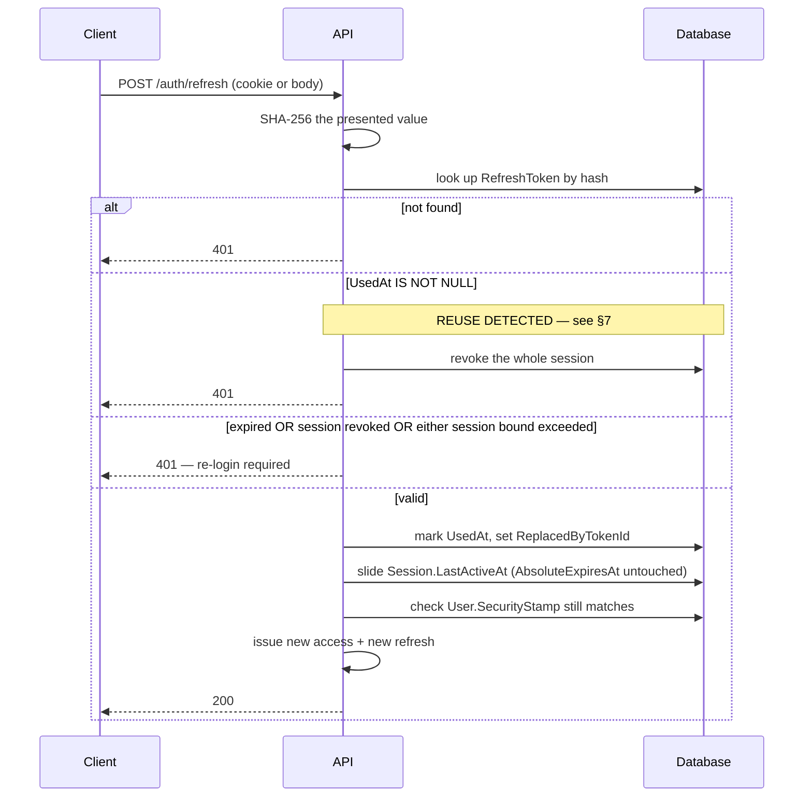
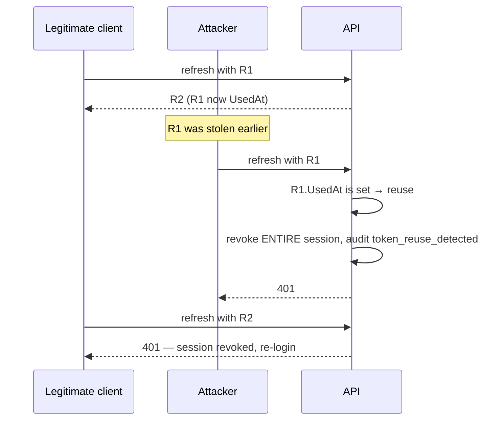
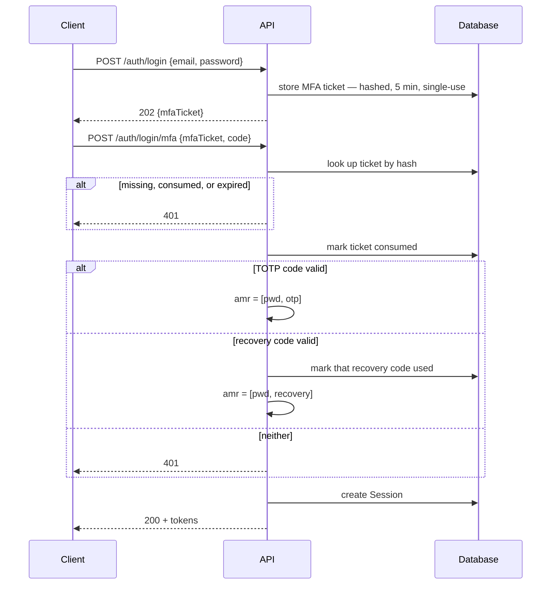
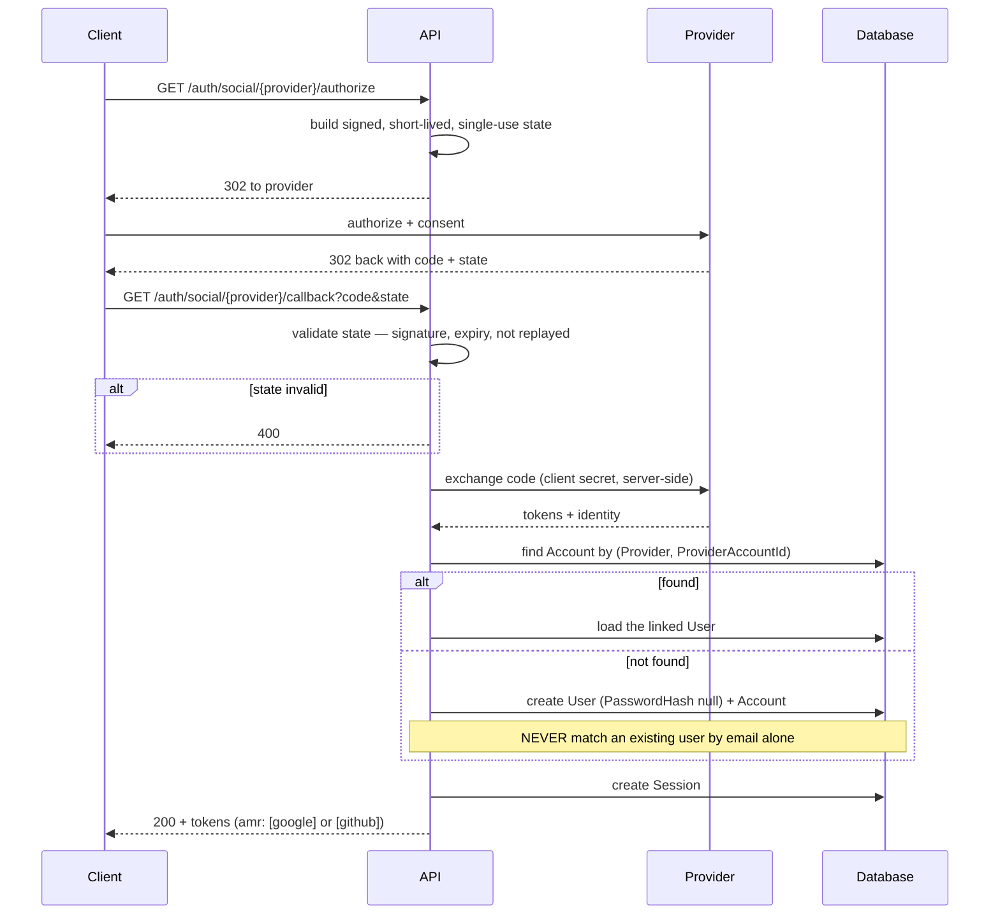
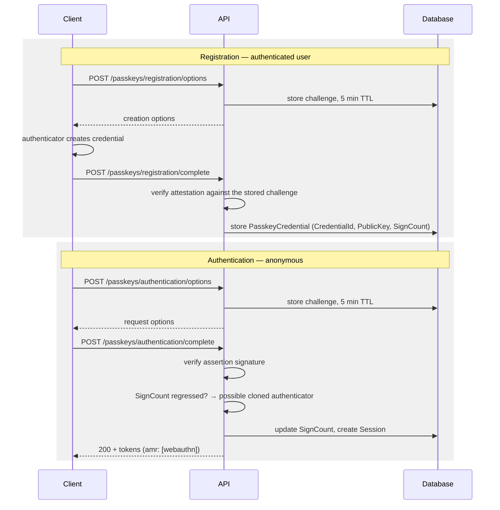
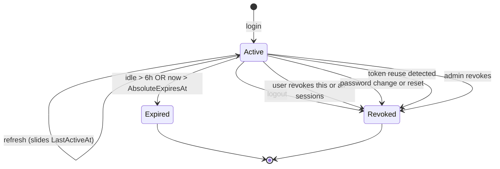
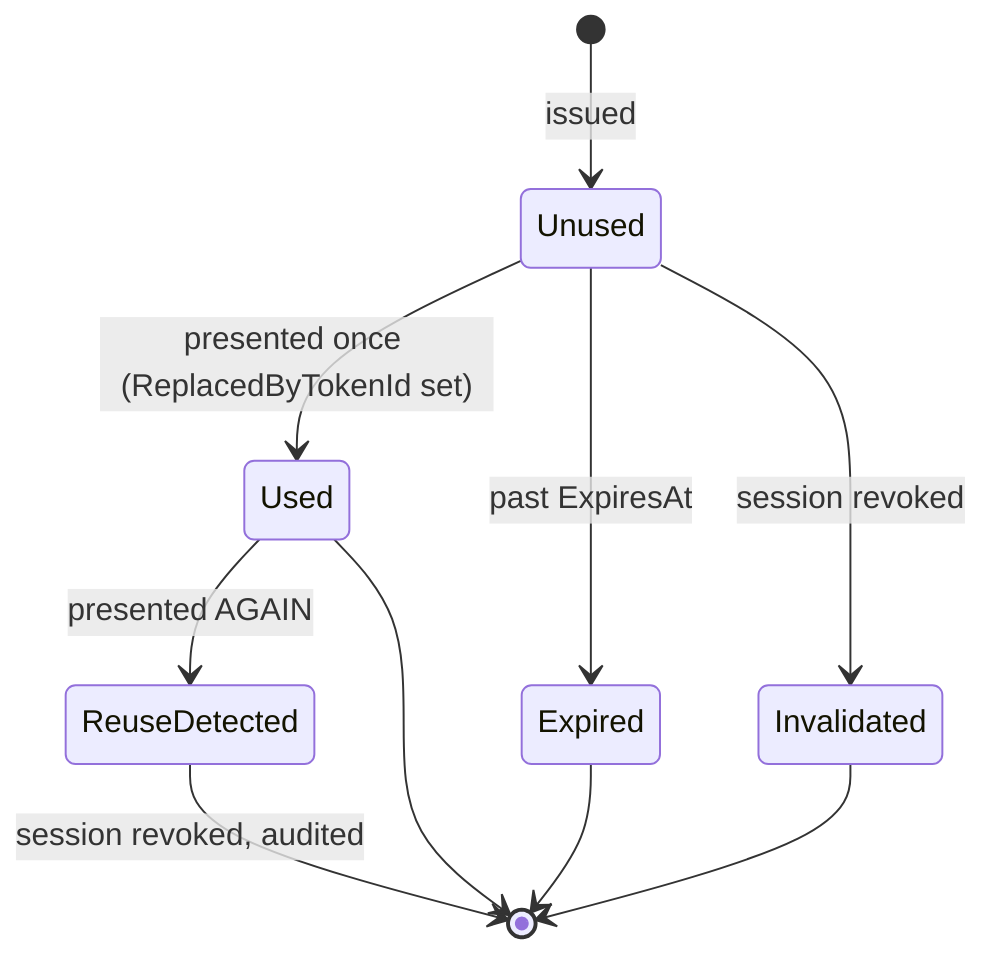

# Authentication and Token Architecture

**Status:** Approved 2026-07-22 · **Workstream:** §4 · **Implemented by:** §6 (entities), §12 (services)

The complete token lifecycle — issuance, validation, rotation, reuse detection, revocation, key rotation, and transport. This document is the single source of truth for how authentication works; endpoint documentation (§19) links here rather than restating it.

Decisions this document implements: [ADR-0001](../Decisions/ADR-0001-token-strategy.md) (token strategy), [ADR-0002](../Decisions/ADR-0002-session-lifetime-and-model.md) (session lifetime), [ADR-0003](../Decisions/ADR-0003-token-transport.md) (transport), [ADR-0004](../Decisions/ADR-0004-signing-key-management.md) (key ring), [ADR-0006](../Decisions/ADR-0006-password-hashing.md) (hashing), [ADR-0019](../Decisions/ADR-0019-social-login.md) (social), [ADR-0020](../Decisions/ADR-0020-signing-key-storage.md) (key storage).

---

## 1. The two credentials

| | Access token | Refresh token |
|---|---|---|
| Format | JWT, ES256 | 256-bit CSPRNG, opaque |
| Lifetime | **15 minutes** | Bounded by its session |
| Storage at rest | Not stored | **SHA-256 hash only** |
| Validation | Stateless, against JWKS | Database lookup by hash |
| Revocable immediately | **No** — bounded by TTL | Yes |
| Reuse | Freely, until expiry | **Single-use** |

The asymmetry is the design. Access tokens are cheap to validate and therefore cannot be revoked; refresh tokens are revocable and therefore cost a database round-trip. The 15-minute TTL is the revocation-lag bound, not a tuning knob.

---

## 2. Access-token claims

| Claim | Value | Notes |
|---|---|---|
| `iss` | configured issuer | Validated strictly |
| `aud` | configured audience | Validated strictly |
| `sub` | user id (GUID) | |
| `sid` | session id (GUID) | Ties the token to one session row |
| `jti` | token id (GUID) | Audit correlation |
| `iat` / `exp` | issued / expiry | 15-minute span |
| `auth_time` | epoch seconds | When the **user** last authenticated, not when this token was minted. Survives refresh unchanged. Drives step-up (§14) |
| `email_verified` | bool | Gates flows that require a verified address |
| `roles` | string array | Source for policy-based authorization (§5) |
| `amr` | array: `pwd`, `otp`, `webauthn`, `recovery`, `google`, `github` | **How** this session authenticated |
| `token_use` | `access` | Rejects a refresh token presented as a bearer token |

**Validation is pinned:** `alg` must be `ES256`. The algorithm is never read from the token header to select a validation strategy.

Two specific attacks this closes, both in §22's list:

- **`alg: none`** — a token claiming no signature. Rejected because `ES256` is required, not merely accepted.
- **Algorithm confusion** — an attacker takes our *public* key (freely available from JWKS), signs a token with `HS256` using that public key as the HMAC secret, and submits it. A validator that reads `alg` from the header would verify it successfully. Pinning `alg` to `ES256` means the HMAC path is never reachable. This is the reason JWKS being public is safe, and it only holds while the pin holds.

**Clock skew: 30 seconds.** Configured in `JwtOptions.ClockSkew`, applied to `exp` and `nbf`. It is deliberately small: the default 5 minutes would extend every access token's effective life by a third.

---

## 3. Transport

Client selects with `X-Auth-Transport: cookie|body` on login. Default `body`. **The server never issues tokens in both places at once** ([ADR-0003](../Decisions/ADR-0003-token-transport.md)).

### Cookie matrix

| Cookie | Contents | `httpOnly` | `Secure` | `SameSite` | `Path` |
|---|---|---|---|---|---|
| `__Host-auth.access` | access token | ✅ | ✅ | `Lax` | `/` |
| `__Secure-auth.refresh` | refresh token | ✅ | ✅ | **`Strict`** | `/api/v1/auth/refresh` |
| `__Host-auth.csrf` | CSRF token | ❌ *(by design)* | ✅ | `Lax` | `/` |

The refresh cookie cannot use `__Host-` because that prefix requires `Path=/`, which would defeat the path scoping. Path scoping won: the browser then never attaches the refresh token to any request other than a refresh.

The CSRF cookie is deliberately readable — double-submit requires JavaScript to copy it into `X-CSRF-Token`.

### CSRF

Cookie mode only. `GET /api/v1/auth/csrf` sets the CSRF cookie; every state-changing request **authenticated by cookie** must echo it in `X-CSRF-Token`. The filter **exempts bearer-authenticated requests** — they carry no ambient credential and are not reachable by CSRF.

**The token is bound to the session, not merely random.** Plain double-submit — compare cookie value to header value — is weaker than it looks: an attacker who can write a cookie for the site (a compromised sibling subdomain, since cookies ignore port and scheme boundaries) can set *both* halves and pass the comparison. Binding closes that.

```text
csrfToken = base64url(nonce) || "." || base64url(HMAC(key, sessionId || nonce))
```

The filter verifies the MAC **against the session the request authenticated as**, so a token minted for another session — or forged wholesale — fails even when cookie and header agree. §22 asserts exactly this ("CSRF token bound to session").

> Getting the bearer exemption wrong in the permissive direction (exempting everything) silently disables CSRF protection across the API. §22 asserts the filter fires for cookie-authenticated state-changing requests.

---

## 4. Session lifetime

Two bounds, **both** of which must hold ([ADR-0002](../Decisions/ADR-0002-session-lifetime-and-model.md)):

```text
now < LastActiveAt + 6 hours        sliding inactivity window
AND
now < AbsoluteExpiresAt             login time + 7 days, written once
```

A successful refresh slides `LastActiveAt`. **It never extends `AbsoluteExpiresAt`** — implementations must not "helpfully" extend it, which would silently defeat the cap.

The two failure modes are distinguishable in the response so a client can tell "you were idle" from "your session aged out".

---

## 5. Login



Password verification is deliberately slow ([ADR-0006](../Decisions/ADR-0006-password-hashing.md)), which makes login both attacker-facing and expensive. It gets its own rate-limit bucket (§17) rather than sharing a general one.

**Three properties this flow must preserve**, owned by §16 but load-bearing here because they constrain what the flow may return:

| Property | Constraint on this flow |
|---|---|
| **No user enumeration** | Unknown user, wrong password, and locked account all return the **same** `invalid_credentials` code and the same response shape. §12 runs a dummy Argon2id hash when no user exists so the timing matches too — without it the "no user" branch returns in microseconds and the fast path *is* the oracle. |
| **Lockout invisible** | 5 consecutive failures → 15-minute lock (§16). The locked response is byte-identical to a wrong password. A distinct "account locked" response tells an attacker the account exists. |
| **Counter reset** | `FailedLoginCount` resets on success. A user who mistypes four times then succeeds must not be one mistake away from lockout tomorrow. |

`amr` on this path is `[pwd]`, and `auth_time` is set to now — see §14 for why the distinction from `iat` matters.

---

## 6. Refresh and rotation



`SecurityStamp` is checked **here, not per request**. That preserves stateless access-token validation while still giving a global per-user kill switch that takes effect within one access-token lifetime.

---

## 7. Reuse detection

An already-used refresh token means one of two things: an attacker is replaying a stolen token, or the legitimate client retried. Neither can be distinguished, so the safe reading is assumed.



**The whole session is revoked, not just the token.** The legitimate user is forced to re-authenticate and the event is audited. That is loud by design: an attacker silently coexisting on a live session is a far worse outcome than a user re-logging in.

---

## 8. MFA challenge



The ticket is a credential in its own right: hashed at rest, single-use, 5-minute TTL, and stored as a `VerificationToken` of type `MfaChallenge`. It authorises exactly one thing — completing this login.

---

## 9. Social callback

Google and GitHub, API-driven redirect ([ADR-0019](../Decisions/ADR-0019-social-login.md)).



**Provider asymmetry:** Google is OIDC and asserts a verified email, so `EmailVerified` may be set from it. GitHub is OAuth 2.0 only — its email comes from a separate call and carries no verification guarantee, so a GitHub login **does not** set `EmailVerified` unless that response marks the address verified *and* primary.

---

## 10. Passkey ceremonies



Challenges are single-use and server-side. A non-increasing `SignCount` is the WebAuthn cloned-authenticator signal — it is audited, and §22 covers it.

---

## 11. State machines

### Session



`RevocationReason` is recorded on every transition into `Revoked` — it is what makes an audit trail answerable after the fact.

### RefreshToken



Used tokens are **retained**, not deleted — a deleted token is indistinguishable from one that never existed, and reuse detection depends on telling those apart. Cleanup happens only after the parent session is well past its absolute expiry (§12 background worker).

---

## 12. Signing keys

Ring of `SigningKey` rows, ES256, private material protected by Data Protection ([ADR-0020](../Decisions/ADR-0020-signing-key-storage.md)).

| State | Signs | Validates | In JWKS |
|---|---|---|---|
| `Active` | ✅ | ✅ | ✅ |
| `Retiring` | ❌ | ✅ | ✅ |
| `Retired` | ❌ | ❌ | ❌ |

**Rotation:** generate a new `Active` → demote the previous to `Retiring` → wait **at least access TTL + clock skew (15 min + 30 s)** → mark `Retired`.

Retiring a key earlier than that invalidates tokens still legitimately in flight. The runbook (§27) states the minimum wait explicitly rather than leaving it to judgement.

### `kid` resolution

Every token carries `kid`. Resolution is **exact-match only**:

| Presented `kid` | Result |
|---|---|
| Matches an `Active` key | Validate |
| Matches a `Retiring` key | Validate |
| Matches a `Retired` key | **Reject** — 401 |
| Unknown, malformed, or absent | **Reject** — 401 |

**There is no fallback.** A validator that responds to an unresolvable `kid` by trying every key in the ring defeats the entire point of `kid`-based rotation: a retired key would keep validating, so retirement would stop meaning anything and a leaked old key would stay useful indefinitely.

Both cases are §22 tests ("unknown `kid`", "retired-key `kid`"). The retired case is the one most likely to regress, because it looks like a harmless robustness improvement to whoever adds the fallback.

---

## 13. Global revocation paths

| Trigger | Effect |
|---|---|
| Logout | Current session revoked |
| Revoke one session | That session revoked |
| Revoke all | All sessions except current |
| Password change **or** reset | `SecurityStamp` bumped, **all** sessions revoked |
| Token reuse detected | That session revoked, audited |
| Admin revokes user sessions | All sessions for that user |

In every case the access token already issued stays cryptographically valid until its `exp` — at most 15 minutes. That is the accepted, bounded cost of stateless validation.

---

## 14. Step-up: recent authentication

Three endpoints in the inventory are marked 🔐 *(recent auth)*:

| Endpoint | Why |
|---|---|
| `DELETE /api/v1/mfa/totp` | Removing a second factor |
| `POST /api/v1/mfa/recovery-codes/regenerate` | Invalidates the user's printed codes |
| `DELETE /api/v1/users/me` | Irreversible account deletion |

These are the operations an attacker performs **after** stealing a live session, and a valid access token alone must not be enough to authorise them.

`PUT /api/v1/users/me/password` is deliberately **not** in this list. It requires the current password, which is a stronger proof than a recent-authentication timestamp — and demanding both would mean re-authenticating in order to re-authenticate.

### Definition

A request is *recently authenticated* when:

```text
now - auth_time < RecentAuthenticationWindow    (default 5 minutes)
```

`auth_time` records when the **user** last proved an authentication factor. It is **not** `iat`:

- `iat` is when *this token* was minted, and moves forward on every refresh.
- `auth_time` is when the *user* last authenticated, and **survives refresh unchanged**.

Using `iat` here would be a silent, total defeat of the control: a stolen session refreshes every 15 minutes, so `iat` is always recent, and step-up would pass permanently for exactly the attacker it exists to stop.

### Re-authentication

A request failing the window gets **403** with a Problem Details `type` identifying it as a step-up requirement — distinguishable from a plain authorization failure so a client can prompt rather than log the user out. The user re-authenticates through the ordinary login endpoint; on success `auth_time` on the session is updated and subsequent tokens carry the new value.

`amr` still matters at step-up. An account with TOTP enrolled must re-satisfy MFA — accepting a password-only re-authentication would let an attacker holding only the password strip the second factor.

> §22 covers this as "recent-auth expiry → step-up denied". The `auth_time`-versus-`iat` distinction is the part worth a test that reads deliberately, because the bug it prevents is invisible in a passing happy path.

---

## 15. API keys

Format `ak_<prefix>_<secret>`. The prefix is stored in plaintext for O(1) lookup; the secret is Argon2id-hashed with a **deliberately cheap profile** — API keys are high-entropy machine-generated secrets, not human-chosen passwords, so they are not dictionary-attackable and do not need a slow hash.

That fast profile must never be applied to user passwords. The two profiles are separately named configuration, and §22 asserts the password path uses the slow one.

Authenticated by a dedicated `ApiKeyAuthenticationHandler` scheme. Scopes map to the permission constants (§5). API keys do **not** create sessions, do **not** participate in refresh, and **can never satisfy step-up** (§14) — they carry no `auth_time` because no human authenticated.

---

## 16. Attack-to-defence coverage

Every attack in §22's negative-test list, mapped to the defence designed for it. §22 turns this into `Documentation/Security/AttackCoverage.md` with concrete test names; this table is the design-side half and is what §4's Definition of Done requires.

| §22 attack | Defence | Where |
|---|---|---|
| `alg: none` | `alg` pinned to ES256 | §2 |
| HS256 using the public key as HMAC secret | Same pin — the HMAC path is unreachable | §2 |
| Tampered payload | Signature verification | §2 |
| Expired token (time advance) | `exp` + 30 s skew; `TimeProvider` makes it testable | §2 |
| Wrong `iss` / `aud` | Strict validation of both | §2 |
| Unknown `kid` | Exact-match resolution, no fallback | §12 |
| Retired-key `kid` | Retired keys resolve to nothing | §12 |
| Replay a rotated refresh token | Reuse detection revokes the **whole session**, audited; legitimate holder is logged out | §7 |
| Cross-session refresh token use | Token is bound to a session row; rotation validates that session, not the caller's claim | §6 |
| Token from a revoked session | `RefreshOutcome.SessionRevoked` | §6 |
| Cookie-mode change with no `X-CSRF-Token` | CSRF filter rejects | §3 |
| Cookie-mode change with a wrong token | MAC verification fails | §3 |
| CSRF token from another session | Token is MAC-bound to `sessionId` | §3 |
| Register / reset / login enumeration (body **and** timing) | Identical shapes and codes; dummy hash equalises timing | §5, §16 |
| Lockout boundary, reset-on-success, invisibility | 5 / 15 min, response identical to bad credentials | §5, §16 |
| 👑 endpoint as `User` → 403 | Policy-based authorization | §5 *(workstream)* |
| 🔐 endpoint anonymous → 401 | Authentication schemes | §3 |
| API key beyond its scopes → 403 | Scopes map to permission constants | §15 |
| **Recent-auth expiry → step-up denied** | `auth_time`, not `iat`; 5-minute window | **§14** |
| Tokens or secrets appearing in logs | Never-log list; structured properties only | ADR-0010 |

### Properties the above depends on

1. Refresh tokens are never stored in plaintext — a database compromise yields no usable token.
2. Reuse detection revokes the session, not just the token.
3. `alg` is pinned; the token header never selects the validation strategy.
4. `kid` resolution is exact-match with no fallback.
5. `SameSite=Strict` plus path scoping keeps the refresh cookie off every request but the refresh.
6. The CSRF token is bound to the session, not merely double-submitted.
7. MFA tickets, WebAuthn challenges, and verification tokens are single-use, hashed, and short-lived.
8. `SecurityStamp` is a per-user kill switch independent of token TTLs.
9. `auth_time` survives refresh, so step-up cannot be laundered by rotating tokens.
10. Login failures are indistinguishable between "no such user", "wrong password", and "locked", in message and timing.
11. Private signing keys are never logged, never serialised into a response, and never appear in a Problem Details payload.

### Not defended here — owned elsewhere

§22 also lists oversized bodies, malformed JSON, correlation-ID header injection, and sort-field injection. These are input-handling concerns owned by §13 (response standards), §14 (middleware) and §17 (rate limiting); they are named here only so the omission is deliberate rather than overlooked.

---

## 17. Interfaces and options

Defined in this workstream, implemented in §12:

| Type | Responsibility |
|---|---|
| `IAccessTokenIssuer` | Mint and sign a JWT for a session |
| `IRefreshTokenService` | Issue, rotate, detect reuse, revoke |
| `ISessionService` | Create, validate against both bounds, revoke |
| `ISigningKeyManager` | Active key, JWKS projection, rotation |
| `IMfaTicketService` | Issue and consume MFA challenge tickets |

| Options | Covers |
|---|---|
| `JwtOptions` | issuer, audience, 15-min TTL, 30-s skew, `ES256`, key-retirement grace |
| `AuthSessionOptions` | 6-h sliding window, 7-day absolute cap, **5-min step-up window**, ticket and challenge lifetimes, cleanup interval |
| `AuthCookieOptions` | the cookie matrix in §3 |

All three are validated at startup (§25). A misconfigured cookie policy or an unset issuer must fail the process at boot, not produce a subtly insecure runtime.

> Named `AuthCookieOptions`, not `CookieOptions` as the roadmap wrote it — `Microsoft.AspNetCore.Http.CookieOptions` already exists and is in scope through implicit usings, so the roadmap's name would collide on every file that touches both.
