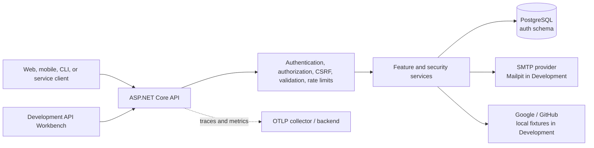

<div align="center">

# .NET Web API Startpack

**A security-focused, headless authentication and authorization API built with .NET 10 and PostgreSQL.**

[](README.tr.md)

[](https://github.com/NAKAMOZ/dotnet-web-api-startpack/actions/workflows/ci.yml)


</div>

## Overview

.NET Web API Startpack is an original, API-first authentication system for applications
that need more than a basic login endpoint. It provides email and password authentication,
rotating refresh tokens, device sessions, role-based authorization, email verification,
password reset, TOTP multi-factor authentication, Google and GitHub login, passkeys, API
keys, audit records, and production-oriented operational controls.

The project is architecturally inspired by the feature shape of Better Auth, but no Better
Auth source code is copied. It does not ship an end-user login page or an admin panel.
Instead, Development and Staging include an API Workbench at `/playground/` for exploring
and testing the complete API.

**Current status:** the v1 feature services and all 43 documented API operations are
implemented. The repository also contains tests, a container image, a local Compose stack,
an EF migration bundle workflow, runbooks, and target-neutral production guidance. A
production hosting target, CD workflow, and software licence have not yet been selected.

## Table of contents

- [What is included](#what-is-included)
- [Technology stack](#technology-stack)
- [System overview](#system-overview)
- [Quick start with Docker](#quick-start-with-docker)
- [Development data](#development-data)
- [Run the API locally](#run-the-api-locally)
- [Explore and call the API](#explore-and-call-the-api)
- [Authentication modes](#authentication-modes)
- [Endpoint map](#endpoint-map)
- [Database and data locations](#database-and-data-locations)
- [Configuration and secrets](#configuration-and-secrets)
- [Migrations and seed data](#migrations-and-seed-data)
- [Testing and quality gates](#testing-and-quality-gates)
- [Observability and health](#observability-and-health)
- [Deployment notes](#deployment-notes)
- [Repository map](#repository-map)
- [Troubleshooting](#troubleshooting)
- [Documentation](#documentation)
- [Licence](#licence)

## What is included

| Area | Capabilities |
|---|---|
| Authentication | Registration, email/password login, logout, access tokens, refresh-token rotation, and replay detection |
| Sessions | Per-device sessions, a 6-hour inactivity window, a 7-day absolute lifetime, individual revocation, and bulk revocation |
| Authorization | Deny-by-default policies, `Admin` and `User` roles, code-defined permissions, API-key scope intersection, and recent-authentication checks |
| Account recovery | Email verification, password reset, account lockout, and enumeration-resistant responses |
| MFA | TOTP enrollment and verification, MFA login tickets, and one-time recovery codes |
| Social login | Google and GitHub OAuth, with deterministic provider fixtures in Development |
| Passkeys | WebAuthn/FIDO2 registration and authentication ceremonies, credential listing, and removal |
| API keys | Show-once secrets, prefix-based lookup, scopes, expiry, listing, and revocation |
| Administration | User search and management, role assignment, forced session revocation, and audit-log queries |
| Security | Argon2id hashing, ES256 JWT signing, secure cookie transport, session-bound CSRF protection, rate limiting, security headers, and RFC 9457 errors |
| Operations | PostgreSQL migrations, signing-key operations, cleanup workers, structured logs, OpenTelemetry, health probes, Docker, and GitHub Actions |
| Developer experience | API Workbench, Scalar, OpenAPI, `.http` requests, Mailpit, deterministic fixtures, and synchronized endpoint documentation |

## Technology stack

- .NET 10 and ASP.NET Core
- Entity Framework Core 10 and Npgsql
- PostgreSQL 18 with the `citext` extension
- ES256 JSON Web Tokens and a published JWKS
- ASP.NET Core Data Protection persisted to PostgreSQL
- Argon2id password and secret hashing
- FluentValidation
- Fido2NetLib for WebAuthn/passkeys
- Otp.NET for TOTP
- Serilog structured logging
- OpenTelemetry traces and metrics with optional OTLP export
- Scalar and OpenAPI
- React 19, TanStack Start/Router, Vite, Effect, Tailwind CSS, and shadcn/ui for the Workbench
- xUnit v3, Testcontainers, Respawn, NSubstitute, and Coverlet
- Docker and Docker Compose
- Mailpit v1.30.5 for local SMTP capture and email inspection

NuGet versions are pinned centrally in
[`Directory.Packages.props`](Directory.Packages.props), and solution-wide compiler rules
are defined in [`Directory.Build.props`](Directory.Build.props). Warnings and configured
code-style violations fail the build.

## System overview



The API is intentionally headless. `/playground/` is a development and staging tool, not
an end-user application.

## Quick start with Docker

### Requirements

- Git
- Docker Engine or Docker Desktop with Docker Compose v2.20+
- Free local ports `5035`, `55432`, `8025`, and `1025`, unless overridden in `.env`

### Start the complete local stack

```bash
git clone https://github.com/NAKAMOZ/dotnet-web-api-startpack.git
cd dotnet-web-api-startpack
cp .env.example .env
docker compose pull postgres mailpit
docker compose up --build --detach
```

`docker compose pull postgres mailpit` refreshes the floating `postgres:18-alpine` tag to
the latest PostgreSQL 18 patch before startup. Subsequent starts can use only
`docker compose up --build --detach` when no image refresh is needed.

Docker Compose starts the following services:

| Service | Address | Purpose |
|---|---|---|
| API | <http://localhost:5035> | ASP.NET Core API |
| API Workbench | <http://localhost:5035/playground/> | Run and inspect every endpoint |
| Scalar | <http://localhost:5035/scalar/v1> | Interactive OpenAPI reference |
| OpenAPI JSON | <http://localhost:5035/openapi/v1.json> | Machine-readable API contract |
| Mailpit v1.30.5 UI | <http://localhost:8025> | Inspect local verification and reset emails |
| Mailpit SMTP | `localhost:1025` | Local SMTP receiver |
| PostgreSQL | `localhost:55432` | Local database connection |

Verify readiness:

```bash
curl --fail http://localhost:5035/health/live
curl --fail http://localhost:5035/health/ready
```

View service logs:

```bash
docker compose logs --follow api
```

Stop the stack without deleting its database:

```bash
docker compose down
```

To intentionally delete all local PostgreSQL data and start from a clean database:

```bash
docker compose down --volumes
docker compose up --build --detach
```

The `--volumes` option is destructive. Omit it when you want to preserve local accounts,
sessions, and other database records.

## Development data

Development startup applies migrations and idempotently creates the following local-only
fixtures. The seeder checks the host environment twice and refuses to run outside
Development.

### Accounts

| Role | Email | Password | User ID |
|---|---|---|---|
| Admin | `admin@localhost.dev` | `Dev_Admin_Password_1!` | `0198f3a0-0000-7000-8001-000000000001` |
| User | `user@localhost.dev` | `Dev_User_Password_1!` | `0198f3a0-0000-7000-8001-000000000002` |

Both accounts are already email-verified.

### API key

The following Development-only key belongs to the admin fixture and has every currently
defined permission scope:

```text
ak_demoAdmin01_Dev_Demo_Api_Key_Only_Local_2026
```

### Other deterministic fixtures

| Data | Fixed value |
|---|---|
| Admin role ID | `0198f3a0-0000-7000-8000-000000000001` |
| User role ID | `0198f3a0-0000-7000-8000-000000000002` |
| User session: Safari on iPhone | `0198f3a0-0000-7000-8001-000000000101` |
| User session: Firefox on Linux | `0198f3a0-0000-7000-8001-000000000102` |
| Admin API-key record | `0198f3a0-0000-7000-8001-000000000301` |
| Linked GitHub account | `0198f3a0-0000-7000-8001-000000000401` |
| Audit records | IDs ending in `501`, `502`, and `503` |

Google and GitHub demo mode also produces deterministic local identities without contacting
either provider. Demo OAuth is enabled only in Development.

All fixture definitions live in
[`Data/Seeding/DevDataSeeder.cs`](Data/Seeding/DevDataSeeder.cs). Do not reuse these
credentials or enable this data in any shared or production environment.

## Run the API locally

Use this workflow when you want PostgreSQL and Mailpit in containers but the API running
directly on your machine.

### Requirements

- .NET SDK 10
- Node.js 24 and pnpm 11 (the .NET build produces the Workbench static bundle)
- Docker with Docker Compose
- An editor that supports `.slnx`, such as Visual Studio 2022 17.14+, Rider 2025.1+, or
  Visual Studio Code

### Start infrastructure

```bash
docker compose up --detach postgres mailpit
```

### Configure the local database connection

```bash
dotnet user-secrets set "ConnectionStrings:Postgres" \
  "Host=127.0.0.1;Port=55432;Database=startpack;Username=startpack;Password=local-development-only"
```

### Restore tools and run

```bash
dotnet tool restore
dotnet restore
dotnet run
```

For the development inner loop:

```bash
dotnet watch run
```

The launch profiles expose HTTP on `http://localhost:5035` and HTTPS on
`https://localhost:7052`. Secure cookie testing should use HTTPS. The Compose API
explicitly disables the `Secure` requirement only for its local HTTP environment.

## Explore and call the API

There are four supported ways to inspect and exercise the API locally.

### 1. API Workbench

Open <http://localhost:5035/playground/>.

The Workbench:

- includes all 43 API operations plus liveness and readiness checks;
- publishes the Development accounts, fixture IDs, and demo API key where they are needed;
- supports Bearer, Cookie, and API Key modes;
- keeps visible Bearer and API-key values in the current tab's session storage, while
  Cookie-mode tokens remain in browser-managed HttpOnly cookies;
- automatically captures tokens, MFA tickets, CSRF values, and show-once secrets;
- calculates live TOTP codes after enrollment;
- runs browser-native WebAuthn ceremonies;
- completes local Google and GitHub demo flows;
- generates cURL commands and displays response headers and RFC 9457 error bodies.

The Workbench is available in Development and Staging, and is not mapped in Production.

Its source lives in [`playground-ui/`](playground-ui/) as an independent pnpm project in
the same repository. `pnpm build` prerenders a static TanStack Start SPA and synchronizes
it to `wwwroot/playground/`. A normal .NET build runs that frontend target incrementally;
use `/p:SkipPlaygroundBuild=true` only when a pipeline has already supplied the static
output. Frontend-only development is available with `cd playground-ui && pnpm dev`.

### 2. Scalar and OpenAPI

- Scalar: <http://localhost:5035/scalar/v1>
- OpenAPI: <http://localhost:5035/openapi/v1.json>

Both are available in Development and Staging and intentionally unavailable in Production.

### 3. HTTP request files

The [`http/`](http/) directory contains one executable `.http` file per controller. Visual
Studio, Rider, and VS Code with the REST Client extension can run them directly.

Copy sensitive response values into `http/http-client.private.env.json`. That file is
gitignored; never paste real tokens into committed `.http` files.

### 4. cURL

Default body-token login:

```bash
curl --request POST http://localhost:5035/api/v1/auth/login \
  --header "Content-Type: application/json" \
  --data '{"email":"user@localhost.dev","password":"Dev_User_Password_1!"}'
```

Use the returned access token:

```bash
curl http://localhost:5035/api/v1/users/me \
  --header "Authorization: Bearer <access-token>"
```

## Authentication modes

### Bearer/body mode

Bearer mode is the default login transport. Login and refresh responses contain the access
and refresh tokens. Send the access token on protected requests:

```http
Authorization: Bearer <access-token>
```

Access tokens are ES256 JWTs. Refresh tokens are opaque, rotated on every use, stored only
as hashes, and treated as compromised if a spent token is presented again.

### Cookie mode

Request cookie delivery on login-producing operations with:

```http
X-Auth-Transport: cookie
```

In this mode the response body intentionally omits both tokens. They are written to
HttpOnly cookies instead:

| Cookie | Purpose | Important attributes |
|---|---|---|
| `__Host-auth.access` | Access token | HttpOnly, `SameSite=Lax`, path `/` |
| `__Secure-auth.refresh` | Refresh token | HttpOnly, `SameSite=Strict`, refresh-endpoint path |
| `__Host-auth.csrf` | Double-submit value | JavaScript-readable, session-bound |

Cookie-authenticated state-changing requests must copy the CSRF value into:

```http
X-CSRF-Token: <csrf-token>
```

Fetch or renew it with `GET /api/v1/auth/csrf`. A `403` response with
`errorCode: csrf_validation_failed` means the client should fetch a fresh value and retry
once.

### API key mode

Send a personal access key with:

```http
Authorization: ApiKey <api-key>
```

API keys authenticate through a dedicated scheme. Their scopes are intersected with the
owner's role permissions, so a key cannot grant more authority than its owner has. API
keys cannot satisfy recent-human-authentication requirements.

## Endpoint map

The OpenAPI document contains 43 operations. Every operation has a matching Markdown
contract under [`Documentation/`](Documentation/); synchronization tests fail if the code,
OpenAPI, and documentation drift apart.

| Group | Operations | Documentation |
|---|---:|---|
| Authentication | 6 — register, login, MFA login, refresh, logout, CSRF | [`Documentation/Auth/`](Documentation/Auth/) |
| Social authentication | 2 — authorize and callback | [`Documentation/SocialAuth/`](Documentation/SocialAuth/) |
| Sessions | 3 — list, revoke one, revoke all | [`Documentation/Sessions/`](Documentation/Sessions/) |
| Email verification | 2 — send and confirm | [`Documentation/EmailVerification/`](Documentation/EmailVerification/) |
| Password reset | 2 — request and confirm | [`Documentation/PasswordReset/`](Documentation/PasswordReset/) |
| TOTP MFA | 4 — enroll, confirm, disable, regenerate recovery codes | [`Documentation/Mfa/`](Documentation/Mfa/) |
| Passkeys | 6 — registration, authentication, list, delete | [`Documentation/Passkeys/`](Documentation/Passkeys/) |
| API keys | 3 — create, list, revoke | [`Documentation/ApiKeys/`](Documentation/ApiKeys/) |
| User self-service | 6 — profile, password, deletion, linked accounts | [`Documentation/Users/`](Documentation/Users/) |
| Administration | 8 — users, roles, sessions, audit logs | [`Documentation/Admin/`](Documentation/Admin/) |
| Well-known | 1 — ES256 JWKS | [`Documentation/WellKnown/`](Documentation/WellKnown/) |

Operational endpoints:

| Method and route | Purpose |
|---|---|
| `GET /health/live` | Process liveness; no external dependency |
| `GET /health/ready` | PostgreSQL reachability and migration readiness |
| `GET /.well-known/jwks.json` | Public active and retiring signing keys |

## Database and data locations

### Local connection

The default Compose connection is:

```text
Host=127.0.0.1;Port=55432;Database=startpack;Username=startpack;Password=local-development-only
```

Compose stores PostgreSQL files in the named `postgres18-data` volume. PostgreSQL 18 uses
the version-aware `/var/lib/postgresql/18/docker` data directory inside that volume.
Application tables
live in the PostgreSQL `auth` schema, not `public`.

If this repository was previously run with PostgreSQL 17, Compose leaves the old
`dotnet-web-api-startpack_postgres-data` volume untouched and initializes PostgreSQL 18 in
`dotnet-web-api-startpack_postgres18-data`. Existing PostgreSQL 17 records are not imported
automatically; use `pg_dump`/`pg_restore` or `pg_upgrade` when that data must be retained.
Do not remove the old volume until the migration has been verified.

Inspect the owned tables:

```bash
docker compose exec postgres psql --username startpack --dbname startpack \
  --command "SELECT tablename FROM pg_tables WHERE schemaname = 'auth' ORDER BY tablename;"
```

### Table map

| Table | Stores |
|---|---|
| `Users` | Profile, normalized email, password hash, verification state, security stamp, and lockout state |
| `Roles`, `UserRoles` | The deterministic `Admin` and `User` roles and their assignments |
| `Sessions` | Device/session metadata, authentication methods, activity, expiry, and revocation |
| `RefreshTokens` | Hashed rotating refresh credentials and replacement/replay state |
| `Accounts` | Linked Google/GitHub provider identities |
| `VerificationTokens` | Hashed email-verification and password-reset artifacts |
| `TotpCredentials`, `RecoveryCodes` | Protected TOTP secrets and hashed one-time recovery codes |
| `PasskeyCredentials` | WebAuthn credential IDs, public keys, counters, and labels |
| `ApiKeys` | Key prefix, hashed secret, scopes, expiry, and revocation state |
| `AuditLogEntries` | Security-sensitive events, metadata, actor, IP, user agent, and correlation ID |
| `SigningKeys` | Active and retiring ES256 signing keys; private material is protected |
| `DataProtectionKeys` | The shared ASP.NET Core Data Protection key ring |
| `__EFMigrationsHistory` | Applied EF Core migration history |

The database stores no plaintext password, refresh token, verification token, recovery
code, or complete API-key secret. See
[`Documentation/Architecture/DataAccess.md`](Documentation/Architecture/DataAccess.md) for
mapping, constraints, indexes, and deletion behavior.

## Configuration and secrets

ASP.NET Core configuration precedence is:

```text
appsettings.json
→ appsettings.{Environment}.json
→ Development user-secrets
→ environment variables
→ command-line arguments
```

The only required infrastructure setting is the PostgreSQL connection string:

| Setting | Environment variable | Notes |
|---|---|---|
| `ConnectionStrings:Postgres` | `ConnectionStrings__Postgres` | Required; startup fails clearly when absent |
| `Jwt:Issuer` | `Jwt__Issuer` | Set to the public HTTPS issuer in production |
| `Jwt:Audience` | `Jwt__Audience` | Token audience |
| `AuthCookies:RequireSecure` | `AuthCookies__RequireSecure` | Keep `true` outside local HTTP development |
| `Cors:AllowedOrigins` | `Cors__AllowedOrigins__0`, … | Bearer-mode browser origins |
| `Cors:CookieModeOrigins` | `Cors__CookieModeOrigins__0`, … | Credentialed cookie-mode origins |
| `ReverseProxy:Enabled` | `ReverseProxy__Enabled` | Required outside Development/Testing |
| `ReverseProxy:KnownProxies` | `ReverseProxy__KnownProxies__0`, … | Exact trusted proxy addresses |
| `Email:Host` | `Email__Host` | SMTP host |
| `Email:Password` | `Email__Password` | SMTP secret, when required |
| `Telemetry:OtlpExporterEnabled` | `Telemetry__OtlpExporterEnabled` | Enables OTLP export |
| `Telemetry:OtlpEndpoint` | `Telemetry__OtlpEndpoint` | Absolute collector URI |

Google and GitHub credentials use:

```text
SocialProviders__Google__Enabled
SocialProviders__Google__ClientId
SocialProviders__Google__ClientSecret
SocialProviders__GitHub__Enabled
SocialProviders__GitHub__ClientId
SocialProviders__GitHub__ClientSecret
```

Never commit secrets to `appsettings*.json`, `.env`, `.http` files, Compose manifests, or
GitHub workflows. Use Development user-secrets locally and the hosting platform's secret
store in deployed environments.

The complete setting catalog, defaults, cross-field validation rules, and environment
variable names are documented in
[`Documentation/Operations/Configuration.md`](Documentation/Operations/Configuration.md).

## Migrations and seed data

Restore the pinned EF tool once per clone:

```bash
dotnet tool restore
```

Create and review a migration:

```bash
dotnet ef migrations add <DescriptiveName> --output-dir Data/Migrations
dotnet ef migrations script
```

Behavior differs by environment:

- **Development:** startup automatically applies migrations and runs
  `Data/Seeding/DevDataSeeder.cs`.
- **Other environments:** the API never auto-migrates. Run a reviewed migration bundle
  before starting the new application version.
- **All environments:** deterministic `Admin` and `User` role rows are migration-owned
  reference data from `Data/Seeding/RoleSeed.cs`.

Build a production migration bundle:

```bash
dotnet ef migrations bundle \
  --self-contained \
  --runtime linux-x64 \
  --output artifacts/efbundle
```

The full expand-contract policy, rollback guidance, permission requirements, and
Data Protection migration note are in
[`Documentation/Operations/Migrations.md`](Documentation/Operations/Migrations.md).

## Testing and quality gates

Run everything:

```bash
dotnet test
```

Run suites separately:

```bash
dotnet test tests/UnitTests/UnitTests.csproj
dotnet test tests/IntegrationTests/IntegrationTests.csproj
```

Integration tests require a reachable Docker daemon. Testcontainers starts PostgreSQL 18
on a random host port, applies the real migrations, and Respawn resets application state
between tests.

Reproduce the main CI checks:

```bash
dotnet restore
dotnet format dotnet-web-api-startpack.slnx --verify-no-changes --no-restore
dotnet build --configuration Release --no-restore
dotnet test --configuration Release --no-restore
dotnet list package --vulnerable --include-transitive
bash scripts/check-secrets.sh
docker build --tag dotnet-web-api-startpack:local .
```

GitHub Actions runs:

- restore, format verification, Release build, dependency audit, and secret-pattern scan;
- unit tests with a scoped 85% crypto/validator line-coverage gate;
- PostgreSQL integration and adversarial security tests;
- container build and Compose readiness smoke test;
- a self-contained Linux x64 EF migration bundle build.

See [`Documentation/Operations/CI.md`](Documentation/Operations/CI.md) and
[`tests/README.md`](tests/README.md).

## Observability and health

Serilog writes structured logs with correlation and authenticated-user context while
redacting known sensitive values. OpenTelemetry instruments ASP.NET Core, `HttpClient`,
Npgsql, the .NET runtime, and custom authentication metrics.

OTLP export is opt-in:

```bash
docker compose \
  --file docker-compose.yml \
  --file docker-compose.observability.yml \
  up --build
```

Health contracts:

| Endpoint | Success | Failure | Meaning |
|---|---|---|---|
| `/health/live` | `200 Healthy` | `503 Unhealthy` | The process can serve HTTP |
| `/health/ready` | `200 Healthy` | `503 Unhealthy` | PostgreSQL is reachable and no migration is pending |

Health responses deliberately contain no dependency details. See
[`Documentation/Operations/Monitoring.md`](Documentation/Operations/Monitoring.md) for the
metric catalog, initial alerts, dashboards, and telemetry safety rules.

## Deployment notes

The repository builds a non-root Linux container that listens on port `8080` and includes
a liveness health check. CI also produces an EF migration bundle. It does **not** currently
publish an image or deploy to a hosting platform.

Before a production launch:

1. Select the deployment platform and create environment-specific infrastructure as code.
2. Add a software licence.
3. Store all secrets in the platform secret manager.
4. Terminate TLS at a trusted edge and configure the exact proxy allowlist.
5. Configure exact CORS origins; keep cookie and bearer origins separate.
6. Use separate migration and runtime database roles.
7. Run the migration bundle before starting the new image.
8. Configure SMTP and real Google/GitHub credentials if those providers are enabled.
9. Configure an OTLP backend, alert routing, log retention, and database backups.
10. Verify the complete
   [`ProductionChecklist.md`](Documentation/Operations/ProductionChecklist.md).

OpenAPI, Scalar, the Workbench, demo OAuth, automatic migrations, and Development fixture
accounts are not exposed in Production.

Operational signing-key commands:

```bash
dotnet dotnet-web-api-startpack.dll operations rotate-signing-key
dotnet dotnet-web-api-startpack.dll operations retire-signing-keys
```

Read the maintenance and incident runbooks before invoking them in a deployed environment.

## Repository map

```text
.
├── Controllers/                 HTTP routes and response contracts
├── Services/                    Feature, token, crypto, email, and provider services
├── Handlers/                    Authentication, authorization, and CORS handlers
├── Filters/                     CSRF, validation, audit, and target rate-limit filters
├── Middleware/                  Correlation, errors, and security headers
├── DTOs/                        Request and response models
├── Validators/                  FluentValidation rules and stable validation codes
├── Models/                      Persistence/domain entities
├── Data/
│   ├── Configurations/          EF Core entity mappings
│   ├── Migrations/              Versioned PostgreSQL schema
│   └── Seeding/                 Roles and Development fixtures
├── Configuration/              Strongly typed, startup-validated options
├── Logging/                     Serilog and authentication metrics
├── Templates/                   Embedded verification/reset email HTML
├── playground-ui/               React/TanStack Workbench source and frontend tests
├── wwwroot/playground/          Generated Development/Staging static Workbench
├── Documentation/
│   ├── Architecture/            System design
│   ├── Decisions/               Architecture Decision Records
│   ├── Operations/              Configuration, CI, migration, monitoring, and runbooks
│   └── <Feature>/               One contract per endpoint
├── http/                        Executable requests per controller
├── tests/
│   ├── UnitTests/               Isolated behavior and architecture tests
│   └── IntegrationTests/        Real pipeline and PostgreSQL tests
├── deploy/                      Local OpenTelemetry Collector configuration
├── ROADMAP/                     Original 29-workstream implementation plan
├── docker-compose.yml           Local API, PostgreSQL, and Mailpit stack
└── Dockerfile                   Multi-stage non-root production image
```

### Where to make a change

| Change | Primary location | Usually update as well |
|---|---|---|
| Add or change an endpoint | `Controllers/`, `DTOs/`, `Validators/` | Feature service, endpoint Markdown, `.http` file, integration tests |
| Change business behavior | `Services/` or `Handlers/` | Unit/integration tests and architecture docs |
| Change database shape | `Models/`, `Data/Configurations/` | New migration and migration runbook notes |
| Change a setting | `Configuration/`, `appsettings.json` | Configuration reference and startup tests |
| Change permissions | `Handlers/Authorization/Permissions.cs` and `RolePermissionMap.cs` | Authorization tests and endpoint docs |
| Change Development fixtures | `Data/Seeding/DevDataSeeder.cs` | Workbench demo values and migration documentation |
| Change email content | `Templates/` | Email tests and endpoint documentation |
| Change Workbench behavior | `playground-ui/src/` | Vitest, Biome, static build, and manual browser/API verification |

## Troubleshooting

### Startup says the PostgreSQL connection string is missing

For a host-run API, set the Development user-secret shown in
[Run the API locally](#run-the-api-locally). For containers or deployed environments, set
`ConnectionStrings__Postgres`.

### `/health/ready` returns 503

Check PostgreSQL health and API logs:

```bash
docker compose ps
docker compose logs postgres api
```

Readiness also fails when a migration is pending outside Development.

### Cookie login returns no token fields

That is expected. Cookie mode stores both tokens in HttpOnly cookies and deliberately omits
them from JSON. Use protected endpoints directly in Cookie mode, or select Bearer mode
before login when you need the token strings.

### A Cookie-mode mutation returns `csrf_validation_failed`

Fetch `GET /api/v1/auth/csrf`, copy the response token to `X-CSRF-Token`, and retry once.
The Workbench performs this automatically.

### Cookies do not persist over local HTTP

Secure cookies should be tested through `https://localhost:7052`. The Compose-only local
API sets `AuthCookies__RequireSecure=false` because it is bound to local HTTP. Do not carry
that override into production.

### Ports are already in use

Edit the copied `.env` file:

```dotenv
API_PORT=5036
POSTGRES_PORT=55433
MAILPIT_SMTP_PORT=1026
MAILPIT_UI_PORT=8026
```

Then restart Compose.

### Local data is stale or disposable

Reset only when losing local data is acceptable:

```bash
docker compose down --volumes
docker compose up --build --detach
```

## Documentation

Recommended reading:

- [`Documentation/Scope.md`](Documentation/Scope.md) — v1 scope and explicit non-goals
- [`Documentation/Architecture/Authentication.md`](Documentation/Architecture/Authentication.md) — tokens, sessions, cookies, CSRF, MFA, social login, passkeys, and API keys
- [`Documentation/Architecture/Authorization.md`](Documentation/Architecture/Authorization.md) — roles, permissions, ownership, and step-up rules
- [`Documentation/Architecture/DataAccess.md`](Documentation/Architecture/DataAccess.md) — PostgreSQL model and constraints
- [`Documentation/Architecture/Pipeline.md`](Documentation/Architecture/Pipeline.md) — middleware, CORS, errors, and security headers
- [`Documentation/Errors.md`](Documentation/Errors.md) — stable RFC 9457 error catalog
- [`Documentation/Operations/LocalDevelopment.md`](Documentation/Operations/LocalDevelopment.md) — local workflow
- [`Documentation/Operations/Configuration.md`](Documentation/Operations/Configuration.md) — complete configuration reference
- [`Documentation/Operations/Migrations.md`](Documentation/Operations/Migrations.md) — migration and seed-data runbook
- [`Documentation/Operations/ProductionChecklist.md`](Documentation/Operations/ProductionChecklist.md) — go-live evidence checklist
- [`Documentation/Decisions/README.md`](Documentation/Decisions/README.md) — architecture decision index
- [`ROADMAP/README.md`](ROADMAP/README.md) — the implementation workstream board

## Contributing

Before opening a pull request:

```bash
dotnet format dotnet-web-api-startpack.slnx
dotnet build --configuration Release
dotnet test
```

Keep endpoint code, OpenAPI metadata, endpoint Markdown, `.http` examples, and tests in
sync. New dependencies require an architectural decision and an exact version in
`Directory.Packages.props`.

## Licence

No software licence has been selected yet. Until a `LICENSE` file is added, standard
copyright rules apply; public visibility does not grant permission to copy, modify, or
redistribute the code. Select an appropriate licence before announcing a public release.

---

Built as a carefully documented foundation for teams that want to own their authentication
stack rather than hide it behind scaffolding.
