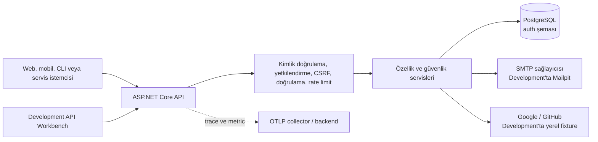

<div align="center">

# .NET Web API Startpack

**.NET 10 ve PostgreSQL ile geliştirilmiş, güvenlik odaklı ve headless bir kimlik doğrulama ve yetkilendirme API'si.**

[](README.md)

[](https://github.com/NAKAMOZ/dotnet-web-api-startpack/actions/workflows/ci.yml)


</div>

## Genel bakış

.NET Web API Startpack, basit bir giriş endpoint'inden daha fazlasına ihtiyaç duyan
uygulamalar için geliştirilmiş, özgün ve API öncelikli bir kimlik doğrulama sistemidir.
E-posta ve parola ile giriş, her kullanımda yenilenen refresh token'lar, cihaz bazlı
oturumlar, rol tabanlı yetkilendirme, e-posta doğrulama, parola sıfırlama, TOTP çok faktörlü
kimlik doğrulama, Google ve GitHub ile giriş, passkey desteği, API anahtarları, denetim
kayıtları ve üretim odaklı operasyonel kontroller sunar.

Proje, özellik yapısı açısından Better Auth'tan mimari olarak esinlenmiştir; Better Auth
kaynak kodundan herhangi bir bölüm kopyalanmamıştır. Son kullanıcıya yönelik bir giriş
sayfası veya yönetim paneli sunmaz. Bunun yerine Development ve Staging ortamlarında tüm
API'yi keşfetmek ve test etmek için `/playground/` adresinde bir API Workbench bulunur.

**Güncel durum:** v1 özellik servisleri ve belgelenmiş 43 API operasyonunun tamamı
uygulanmıştır. Kod deposu ayrıca 379 başarılı test, root olmayan konteyner, yerel Compose
ortamı, Azure Container Apps/Managed Redis/Key Vault altyapı kodu, migration-first OIDC
dağıtım ve k6/ZAP iş akışları ile operasyon rehberlerini içerir. Yazılım lisansı ve gerçek
abonelik rollout kanıtı için hâlâ proje sahibinin işlemi gerekir.

## İçindekiler

- [Neler sunuyor?](#neler-sunuyor)
- [Teknoloji yığını](#teknoloji-yığını)
- [Sistem görünümü](#sistem-görünümü)
- [Docker ile hızlı başlangıç](#docker-ile-hızlı-başlangıç)
- [Geliştirme verileri](#geliştirme-verileri)
- [API'yi yerel makinede çalıştırma](#apiyi-yerel-makinede-çalıştırma)
- [API'yi keşfetme ve kullanma](#apiyi-keşfetme-ve-kullanma)
- [Kimlik doğrulama modları](#kimlik-doğrulama-modları)
- [Endpoint haritası](#endpoint-haritası)
- [Veritabanı ve verilerin konumu](#veritabanı-ve-verilerin-konumu)
- [Konfigürasyon ve secret yönetimi](#konfigürasyon-ve-secret-yönetimi)
- [Migration ve seed verileri](#migration-ve-seed-verileri)
- [Testler ve kalite kapıları](#testler-ve-kalite-kapıları)
- [Gözlemlenebilirlik ve health endpoint'leri](#gözlemlenebilirlik-ve-health-endpointleri)
- [Yayınlama notları](#yayınlama-notları)
- [Repository haritası](#repository-haritası)
- [Sorun giderme](#sorun-giderme)
- [Dokümantasyon](#dokümantasyon)
- [Lisans](#lisans)

## Neler sunuyor?

| Alan | Yetenekler |
|---|---|
| Kimlik doğrulama | Kayıt, e-posta/parola ile giriş, çıkış, access token, refresh-token rotation ve tekrar kullanım tespiti |
| Oturumlar | Cihaz bazlı oturumlar, 6 saatlik hareketsizlik süresi, 7 günlük mutlak ömür, tekil ve toplu iptal |
| Yetkilendirme | Varsayılan olarak reddeden politikalar, `Admin` ve `User` rolleri, kod tabanlı izinler, API-key scope kesişimi ve yakın zamanda doğrulama kontrolü |
| Hesap kurtarma | E-posta doğrulama, parola sıfırlama, hesap kilitleme ve hesap varlığını sızdırmayan yanıtlar |
| MFA | TOTP kurulumu ve doğrulaması, MFA giriş ticket'ları ve tek kullanımlık recovery code'lar |
| Sosyal giriş | Google ve GitHub OAuth; Development ortamında deterministik sağlayıcı fixture verileri |
| Passkey | WebAuthn/FIDO2 kayıt ve giriş seremonileri, credential listeleme ve silme |
| API anahtarları | Yalnızca bir kez gösterilen secret, prefix tabanlı arama, scope, süre sonu, listeleme ve iptal |
| Yönetim | Kullanıcı arama ve yönetimi, rol atama, zorunlu oturum iptali ve audit log sorguları |
| Güvenlik | Argon2id, ES256 JWT, güvenli cookie taşıması, oturuma bağlı CSRF, rate limiting, güvenlik başlıkları ve RFC 9457 hataları |
| Operasyon | PostgreSQL migration'ları, imzalama anahtarı operasyonları, temizlik servisleri, yapılandırılmış loglar, OpenTelemetry, health probe'ları, Docker ve GitHub Actions |
| Geliştirici deneyimi | API Workbench, Scalar, OpenAPI, `.http` istekleri, Mailpit, deterministik fixture verileri ve kodla senkron endpoint dokümantasyonu |

## Teknoloji yığını

- .NET 10 ve ASP.NET Core
- Entity Framework Core 10 ve Npgsql
- `citext` eklentisiyle PostgreSQL 18
- ES256 JSON Web Token ve yayınlanan JWKS
- PostgreSQL'de saklanan ASP.NET Core Data Protection key ring
- Argon2id parola ve secret hashleme
- FluentValidation
- WebAuthn/passkey için Fido2NetLib
- TOTP için Otp.NET
- Serilog ile yapılandırılmış loglama
- İsteğe bağlı OTLP aktarımıyla OpenTelemetry trace ve metric'leri
- Scalar ve OpenAPI
- xUnit v3, Testcontainers, Respawn, NSubstitute ve Coverlet
- Docker ve Docker Compose
- Yerel SMTP yakalama ve e-posta inceleme için Mailpit v1.30.5

NuGet sürümleri [`Directory.Packages.props`](Directory.Packages.props) içinde merkezi olarak
sabitlenmiştir. Çözüm genelindeki derleyici kuralları
[`Directory.Build.props`](Directory.Build.props) içinde tanımlıdır. Warning'ler ve
yapılandırılmış kod stili ihlalleri build'i başarısız eder.

## Sistem görünümü



API bilinçli olarak headless tasarlanmıştır. `/playground/`, son kullanıcı uygulaması değil;
Development ve Staging ortamlarına yönelik bir geliştirme aracıdır.

## Docker ile hızlı başlangıç

### Gereksinimler

- Git
- Docker Engine veya Docker Compose v2.20+ içeren Docker Desktop
- `.env` içinde değiştirilmediği sürece boşta olan `5035`, `55432`, `8025` ve `1025` portları

### Yerel ortamın tamamını başlatma

```bash
git clone https://github.com/NAKAMOZ/dotnet-web-api-startpack.git
cd dotnet-web-api-startpack
cp .env.example .env
docker compose pull postgres mailpit
docker compose up --build --detach
```

`docker compose pull postgres mailpit`, repository'de digest ile sabitlenen PostgreSQL ve
Mailpit imajlarını indirir. Dependabot bunların etiket/digest güncellemelerini haftalık olarak
incelemeye açar. İmajları yenilemek gerekmediğinde sonraki başlangıçlarda yalnızca
`docker compose up --build --detach` kullanılabilir.

Docker Compose aşağıdaki servisleri başlatır:

| Servis | Adres | Amaç |
|---|---|---|
| API | <http://localhost:5035> | ASP.NET Core API |
| API Workbench | <http://localhost:5035/playground/> | Tüm endpoint'leri çalıştırma ve inceleme |
| Scalar | <http://localhost:5035/scalar/v1> | Etkileşimli OpenAPI referansı |
| OpenAPI JSON | <http://localhost:5035/openapi/v1.json> | Makine tarafından okunabilir API sözleşmesi |
| Mailpit v1.30.5 arayüzü | <http://localhost:8025> | Yerel doğrulama ve parola sıfırlama e-postalarını inceleme |
| Mailpit SMTP | `localhost:1025` | Yerel SMTP alıcısı |
| PostgreSQL | `localhost:55432` | Yerel veritabanı bağlantısı |

Hazır olma durumunu doğrulayın:

```bash
curl --fail http://localhost:5035/health/live
curl --fail http://localhost:5035/health/ready
```

Servis loglarını görüntüleyin:

```bash
docker compose logs --follow api
```

Veritabanını silmeden ortamı durdurun:

```bash
docker compose down
```

Tüm yerel PostgreSQL verilerini bilinçli olarak silip temiz bir veritabanıyla başlamak için:

```bash
docker compose down --volumes
docker compose up --build --detach
```

`--volumes` seçeneği yıkıcıdır. Yerel hesapları, oturumları ve diğer veritabanı kayıtlarını
korumak istiyorsanız bu seçeneği kullanmayın.

## Geliştirme verileri

Development başlangıcında migration'lar uygulanır ve aşağıdaki yalnızca yerel kullanıma
yönelik fixture verileri idempotent biçimde oluşturulur. Seeder, host ortamını iki ayrı noktada
kontrol eder ve Development dışında çalışmayı reddeder.

### Hesaplar

| Rol | E-posta | Parola | Kullanıcı ID |
|---|---|---|---|
| Admin | `admin@localhost.dev` | `Dev_Admin_Password_1!` | `0198f3a0-0000-7000-8001-000000000001` |
| User | `user@localhost.dev` | `Dev_User_Password_1!` | `0198f3a0-0000-7000-8001-000000000002` |

İki hesabın e-posta adresi de önceden doğrulanmıştır.

### API anahtarı

Aşağıdaki yalnızca Development ortamına ait anahtar, admin geliştirme hesabına bağlıdır ve güncel
izin scope'larının tamamına sahiptir:

```text
ak_demoAdmin01_Dev_Demo_Api_Key_Only_Local_2026
```

### Diğer deterministik fixture verileri

| Veri | Sabit değer |
|---|---|
| Admin rol ID | `0198f3a0-0000-7000-8000-000000000001` |
| User rol ID | `0198f3a0-0000-7000-8000-000000000002` |
| Kullanıcı oturumu: Safari on iPhone | `0198f3a0-0000-7000-8001-000000000101` |
| Kullanıcı oturumu: Firefox on Linux | `0198f3a0-0000-7000-8001-000000000102` |
| Admin API-key kaydı | `0198f3a0-0000-7000-8001-000000000301` |
| Bağlı GitHub hesabı | `0198f3a0-0000-7000-8001-000000000401` |
| Audit kayıtları | Sonu `501`, `502` ve `503` ile biten ID'ler |

Google ve GitHub demo modu, bu sağlayıcılara bağlanmadan deterministik yerel kimlikler
üretir. Demo OAuth yalnızca Development ortamında etkindir.

Tüm fixture tanımları
[`Data/Seeding/DevDataSeeder.cs`](Data/Seeding/DevDataSeeder.cs) dosyasındadır. Bu kimlik
bilgilerini paylaşılan veya üretim ortamında kullanmayın ve bu verileri o ortamlarda
etkinleştirmeyin.

## API'yi yerel makinede çalıştırma

PostgreSQL ve Mailpit'i container içinde, API'yi ise doğrudan makinenizde çalıştırmak
istediğinizde bu yöntemi kullanın.

### Gereksinimler

- .NET SDK 10
- Docker ve Docker Compose
- `.slnx` destekleyen Visual Studio 2022 17.14+, Rider 2025.1+ veya Visual Studio Code

### Altyapıyı başlatma

```bash
docker compose up --detach postgres mailpit
```

### Yerel veritabanı bağlantısını yapılandırma

```bash
dotnet user-secrets set "ConnectionStrings:Postgres" \
  "Host=127.0.0.1;Port=55432;Database=startpack;Username=startpack;Password=local-development-only"
```

### Araçları geri yükleme ve çalıştırma

```bash
dotnet tool restore
dotnet restore
dotnet run
```

Hızlı geliştirme döngüsü için:

```bash
dotnet watch run
```

Launch profile'ları HTTP için `http://localhost:5035`, HTTPS için
`https://localhost:7052` adresini kullanır. Güvenli cookie testleri HTTPS üzerinden
yapılmalıdır. Compose API'si, yalnızca yerel HTTP ortamı için `Secure` zorunluluğunu
açıkça devre dışı bırakır.

## API'yi keşfetme ve kullanma

API'yi yerel ortamda incelemek ve çalıştırmak için desteklenen dört yöntem vardır.

### 1. API Workbench

<http://localhost:5035/playground/> adresini açın.

Workbench:

- 43 API operasyonunun tamamını ve liveness/readiness kontrollerini içerir;
- Development hesaplarını, fixture ID'lerini ve demo API anahtarını gerektiği yerde gösterir;
- Bearer, Cookie ve API Key modlarını destekler;
- görünür Bearer ve API-key değerlerini geçerli sekmenin session storage alanında tutar;
  Cookie modu tokenları ise tarayıcı tarafından yönetilen HttpOnly cookie'lerde kalır;
- token, MFA ticket, CSRF değeri ve yalnızca bir kez gösterilen secret'ları otomatik yakalar;
- TOTP kurulumundan sonra canlı kod üretir;
- tarayıcının yerel WebAuthn seremonilerini çalıştırır;
- yerel Google ve GitHub demo akışlarını tamamlar;
- cURL komutları üretir, response header'larını ve RFC 9457 hata gövdelerini gösterir.

Workbench Development ve Staging ortamlarında kullanılabilir; Production ortamında
route olarak eklenmez.

Kaynak kodu, aynı depodaki bağımsız pnpm projesi [`playground-ui/`](playground-ui/)
altındadır. `pnpm build`, statik TanStack Start SPA'sını prerender eder ve tekrarlanabilir
biçimde `wwwroot/playground/` dizinine eşitler. Normal bir .NET derlemesi bu frontend hedefini
artımlı olarak çalıştırır; `/p:SkipPlaygroundBuild=true` yalnızca pipeline statik çıktıyı
önceden ürettiyse kullanılmalıdır. Yalnızca frontend geliştirmek için
`cd playground-ui && pnpm dev` kullanılabilir.

### 2. Scalar ve OpenAPI

- Scalar: <http://localhost:5035/scalar/v1>
- OpenAPI: <http://localhost:5035/openapi/v1.json>

İkisi de Development ve Staging ortamlarında kullanılabilir, Production ortamında bilinçli
olarak kapalıdır.

### 3. HTTP istek dosyaları

[`http/`](http/) dizininde her controller için çalıştırılabilir bir `.http` dosyası bulunur.
Visual Studio, Rider ve REST Client eklentisine sahip VS Code bu dosyaları doğrudan
çalıştırabilir.

Hassas yanıt değerlerini `http/http-client.private.env.json` dosyasına kopyalayın. Bu dosya
gitignore kapsamındadır; gerçek tokenları commit edilen `.http` dosyalarına eklemeyin.

### 4. cURL

Varsayılan body-token login:

```bash
curl --request POST http://localhost:5035/api/v1/auth/login \
  --header "Content-Type: application/json" \
  --data '{"email":"user@localhost.dev","password":"Dev_User_Password_1!"}'
```

Dönen access tokenı kullanma:

```bash
curl http://localhost:5035/api/v1/users/me \
  --header "Authorization: Bearer <access-token>"
```

## Kimlik doğrulama modları

### Bearer/body modu

Bearer modu varsayılan login taşıma yöntemidir. Login ve refresh yanıtlarında access ve
refresh tokenlar bulunur. Korumalı isteklerde access tokenı şu şekilde gönderin:

```http
Authorization: Bearer <access-token>
```

Access tokenlar ES256 JWT biçimindedir. Refresh tokenlar opaque yapıdadır, her kullanımda
yenilenir, yalnızca hash olarak saklanır ve daha önce tüketilmiş bir token yeniden
kullanılırsa ele geçirilmiş kabul edilir.

### Cookie modu

Oturum oluşturan operasyonlarda cookie taşımasını şu header ile isteyin:

```http
X-Auth-Transport: cookie
```

Bu modda response body iki tokenı da bilinçli olarak içermez. Tokenlar bunun yerine HttpOnly
cookie'lere yazılır:

| Cookie | Amaç | Önemli nitelikler |
|---|---|---|
| `__Host-auth.access` | Access token | HttpOnly, `SameSite=Lax`, path `/` |
| `__Secure-auth.refresh` | Refresh token | HttpOnly, `SameSite=Strict`, refresh endpoint path'i |
| `__Host-auth.csrf` | Double-submit değeri | JavaScript tarafından okunabilir, oturuma bağlı |

Cookie ile kimliği doğrulanmış ve sistem durumunu değiştiren istekler CSRF değerini şu
header'a kopyalamalıdır:

```http
X-CSRF-Token: <csrf-token>
```

Değeri `GET /api/v1/auth/csrf` ile alın veya yenileyin. `errorCode:
csrf_validation_failed` içeren bir `403` yanıtı, istemcinin yeni bir değer alıp isteği bir
kez yeniden denemesi gerektiği anlamına gelir.

### API key modu

Kişisel erişim anahtarını şu şekilde gönderin:

```http
Authorization: ApiKey <api-key>
```

API anahtarları ayrı bir authentication scheme üzerinden doğrulanır. Scope'ları, anahtar
sahibinin rol izinleriyle kesiştirilir; dolayısıyla bir anahtar sahibinden daha fazla yetki
kazanamaz. API anahtarları yakın zamanda gerçekleştirilmiş insan doğrulaması şartını
karşılayamaz.

## Endpoint haritası

OpenAPI belgesinde 43 operasyon bulunur. Her operasyonun [`Documentation/`](Documentation/)
altında eşleşen bir Markdown sözleşmesi vardır. Kod, OpenAPI ve dokümantasyon arasında fark
oluşursa senkronizasyon testleri başarısız olur.

| Grup | Operasyonlar | Dokümantasyon |
|---|---:|---|
| Kimlik doğrulama | 6 — kayıt, login, MFA login, refresh, logout, CSRF | [`Documentation/Auth/`](Documentation/Auth/) |
| Sosyal kimlik doğrulama | 2 — authorize ve callback | [`Documentation/SocialAuth/`](Documentation/SocialAuth/) |
| Oturumlar | 3 — listeleme, tekil iptal, toplu iptal | [`Documentation/Sessions/`](Documentation/Sessions/) |
| E-posta doğrulama | 2 — gönderme ve onaylama | [`Documentation/EmailVerification/`](Documentation/EmailVerification/) |
| Parola sıfırlama | 2 — istek ve onay | [`Documentation/PasswordReset/`](Documentation/PasswordReset/) |
| TOTP MFA | 4 — kayıt, onay, kapatma, recovery code yenileme | [`Documentation/Mfa/`](Documentation/Mfa/) |
| Passkey | 6 — kayıt, giriş, listeleme, silme | [`Documentation/Passkeys/`](Documentation/Passkeys/) |
| API anahtarları | 3 — oluşturma, listeleme, iptal | [`Documentation/ApiKeys/`](Documentation/ApiKeys/) |
| Kullanıcı işlemleri | 6 — profil, parola, hesap silme, bağlı hesaplar | [`Documentation/Users/`](Documentation/Users/) |
| Yönetim | 8 — kullanıcılar, roller, oturumlar, audit log'lar | [`Documentation/Admin/`](Documentation/Admin/) |
| Well-known | 1 — ES256 JWKS | [`Documentation/WellKnown/`](Documentation/WellKnown/) |

Operasyonel endpoint'ler:

| Metot ve route | Amaç |
|---|---|
| `GET /health/live` | Harici bağımlılık içermeyen process liveness kontrolü |
| `GET /health/ready` | PostgreSQL erişimi ve migration hazır olma kontrolü |
| `GET /.well-known/jwks.json` | Aktif ve emekliye ayrılma sürecindeki public imzalama anahtarları |

## Veritabanı ve verilerin konumu

### Yerel bağlantı

Varsayılan Compose bağlantısı:

```text
Host=127.0.0.1;Port=55432;Database=startpack;Username=startpack;Password=local-development-only
```

Compose, PostgreSQL dosyalarını `postgres18-data` adlı volume içinde saklar. PostgreSQL 18,
bu volume içinde sürüme özel `/var/lib/postgresql/18/docker` veri dizinini kullanır.
Uygulama tabloları `public` yerine PostgreSQL `auth` şemasında bulunur.

Bu repository daha önce PostgreSQL 17 ile çalıştırıldıysa Compose, eski
`dotnet-web-api-startpack_postgres-data` volume'unu değiştirmeden bırakır ve PostgreSQL
18'i `dotnet-web-api-startpack_postgres18-data` içinde başlatır. PostgreSQL 17 kayıtları
otomatik aktarılmaz; bu verilerin korunması gerekiyorsa `pg_dump`/`pg_restore` veya
`pg_upgrade` kullanın. Veri geçişi doğrulanmadan eski volume'u silmeyin.

Uygulamaya ait tabloları inceleyin:

```bash
docker compose exec postgres psql --username startpack --dbname startpack \
  --command "SELECT tablename FROM pg_tables WHERE schemaname = 'auth' ORDER BY tablename;"
```

### Tablo haritası

| Tablo | Saklanan veri |
|---|---|
| `Users` | Profil, normalize e-posta, parola hash'i, doğrulama durumu, security stamp ve kilit durumu |
| `Roles`, `UserRoles` | Deterministik `Admin` ve `User` rolleri ile rol atamaları |
| `Sessions` | Cihaz/oturum bilgileri, doğrulama yöntemleri, aktivite, süre sonu ve iptal durumu |
| `RefreshTokens` | Hashlenmiş, her kullanımda yenilenen refresh token'lar ile ardıl token ve tekrar kullanım durumu |
| `Accounts` | Bağlı Google/GitHub sağlayıcı kimlikleri |
| `VerificationTokens` | Hashlenmiş e-posta doğrulama ve parola sıfırlama verileri |
| `TotpCredentials`, `RecoveryCodes` | Korumalı TOTP secret'ları ve hashlenmiş tek kullanımlık recovery code'lar |
| `PasskeyCredentials` | WebAuthn credential ID, public key, sayaç ve etiketleri |
| `ApiKeys` | Anahtar prefix'i, hashlenmiş secret, scope, süre sonu ve iptal durumu |
| `AuditLogEntries` | Güvenlik olayları, metadata, aktör, IP, user agent ve correlation ID |
| `SigningKeys` | Aktif ve emekliye ayrılan ES256 anahtarları; private materyal korumalıdır |
| `DataProtectionKeys` | Paylaşılan ASP.NET Core Data Protection key ring |
| `__EFMigrationsHistory` | Uygulanmış EF Core migration geçmişi |

Veritabanında plaintext parola, refresh token, verification token, recovery code veya tam
API-key secret'ı saklanmaz. Mapping, constraint, index ve silme davranışları için
[`Documentation/Architecture/DataAccess.md`](Documentation/Architecture/DataAccess.md)
belgesine bakın.

## Konfigürasyon ve secret yönetimi

ASP.NET Core konfigürasyon önceliği:

```text
appsettings.json
→ appsettings.{Environment}.json
→ Development user-secrets
→ environment variable'ları
→ komut satırı argümanları
```

Zorunlu tek altyapı ayarı PostgreSQL connection string'idir:

| Ayar | Environment variable | Not |
|---|---|---|
| `ConnectionStrings:Postgres` | `ConnectionStrings__Postgres` | Zorunlu; yoksa başlangıç açıklayıcı bir hatayla durur |
| `Jwt:Issuer` | `Jwt__Issuer` | Production'da public HTTPS issuer olarak ayarlanmalıdır |
| `Jwt:Audience` | `Jwt__Audience` | Token audience değeri |
| `AuthCookies:RequireSecure` | `AuthCookies__RequireSecure` | Yerel HTTP geliştirme dışında `true` kalmalıdır |
| `Cors:AllowedOrigins` | `Cors__AllowedOrigins__0`, … | Bearer modundaki tarayıcı origin'leri |
| `Cors:CookieModeOrigins` | `Cors__CookieModeOrigins__0`, … | Cookie bilgilerinin gönderilebildiği origin'ler |
| `ReverseProxy:Enabled` | `ReverseProxy__Enabled` | Development/Testing dışında zorunludur |
| `ReverseProxy:KnownProxies` | `ReverseProxy__KnownProxies__0`, … | Güvenilen proxy adresleri |
| `Email:Host` | `Email__Host` | SMTP host'u |
| `Email:Password` | `Email__Password` | Gerektiğinde SMTP secret'ı |
| `Telemetry:OtlpExporterEnabled` | `Telemetry__OtlpExporterEnabled` | OTLP aktarımını açar |
| `Telemetry:OtlpEndpoint` | `Telemetry__OtlpEndpoint` | Mutlak collector URI'ı |

Google ve GitHub kimlik bilgileri:

```text
SocialProviders__Google__Enabled
SocialProviders__Google__ClientId
SocialProviders__Google__ClientSecret
SocialProviders__GitHub__Enabled
SocialProviders__GitHub__ClientId
SocialProviders__GitHub__ClientSecret
```

Secret'ları `appsettings*.json`, `.env`, `.http` dosyaları, Compose manifest'leri veya
GitHub iş akışlarına commit etmeyin. Yerel geliştirmede Development user-secrets,
yayınlanan ortamlarda ise platformun secret store'unu kullanın.

Tüm ayarlar, varsayılanlar, ayarlar arası doğrulama kuralları ve environment variable
adları [`Documentation/Operations/Configuration.md`](Documentation/Operations/Configuration.md)
içinde belgelenmiştir.

## Migration ve seed verileri

Her clone işleminden sonra sabitlenmiş EF aracını bir kez yükleyin:

```bash
dotnet tool restore
```

Migration oluşturun ve SQL'i inceleyin:

```bash
dotnet ef migrations add <DescriptiveName> --output-dir Data/Migrations
dotnet ef migrations script
```

Davranış ortama göre değişir:

- **Development:** başlangıçta migration'lar otomatik uygulanır ve
  `Data/Seeding/DevDataSeeder.cs` çalışır.
- **Diğer ortamlar:** API otomatik migration çalıştırmaz. Yeni uygulama sürümünü yayına
  almadan önce incelenmiş deployment işlemini çalıştırın. Azure tek seferlik Container Apps
  job'ını, diğer platformlar CI'ın ürettiği taşınabilir EF bundle'ını kullanabilir.
- **Tüm ortamlar:** deterministik `Admin` ve `User` rol satırları
  `Data/Seeding/RoleSeed.cs` tarafından tanımlanan, migration'a ait referans verileridir.

Production migration bundle oluşturma:

```bash
dotnet ef migrations bundle \
  --self-contained \
  --runtime linux-x64 \
  --output artifacts/efbundle
```

Expand-contract politikası, rollback rehberi, veritabanı izinleri ve Data Protection
migration notu
[`Documentation/Operations/Migrations.md`](Documentation/Operations/Migrations.md)
belgesinde yer alır.

## Testler ve kalite kapıları

Tüm testleri çalıştırın:

```bash
dotnet test
```

Test projelerini ayrı çalıştırın:

```bash
dotnet test tests/UnitTests/UnitTests.csproj
dotnet test tests/IntegrationTests/IntegrationTests.csproj
```

Integration testleri çalışan bir Docker daemon gerektirir. Testcontainers rastgele host
portlarında PostgreSQL 18 ve Redis başlatır, gerçek migration'ları uygular ve Respawn
veritabanı testleri arasında uygulama durumunu sıfırlar.

Ana CI kontrollerini yerelde çalıştırın:

```bash
dotnet restore
dotnet format dotnet-web-api-startpack.slnx --verify-no-changes --no-restore
dotnet build --configuration Release --no-restore
dotnet test --configuration Release --no-restore
dotnet list package --vulnerable --include-transitive --no-restore
bash scripts/check-secrets.sh
docker build --tag dotnet-web-api-startpack:local .
```

GitHub Actions şu kontrolleri çalıştırır:

- restore, format doğrulaması, Release build, dependency audit ve secret pattern taraması;
- crypto/validator kodları için %85 line coverage sınırıyla unit testler;
- PostgreSQL integration ve saldırı odaklı güvenlik testleri;
- digest ile sabitlenmiş container build, HIGH/CRITICAL açık kapısı ve Compose readiness smoke testi;
- self-contained Linux x64 EF migration bundle üretimi.

[`Documentation/Operations/CI.md`](Documentation/Operations/CI.md) ve
[`tests/README.md`](tests/README.md) belgelerine bakın.

## Gözlemlenebilirlik ve health endpoint'leri

Serilog, bilinen hassas değerleri maskeleyerek correlation ve doğrulanmış kullanıcı
bağlamına sahip yapılandırılmış loglar üretir. OpenTelemetry; ASP.NET Core, `HttpClient`,
Npgsql, .NET runtime ve özel authentication metric'lerini ölçümler.

OTLP aktarımı isteğe bağlıdır:

```bash
docker compose \
  --file docker-compose.yml \
  --file docker-compose.observability.yml \
  up --build
```

Health sözleşmeleri:

| Endpoint | Başarılı | Başarısız | Anlamı |
|---|---|---|---|
| `/health/live` | `200 Healthy` | `503 Unhealthy` | Process HTTP isteğine yanıt verebilir |
| `/health/ready` | `200 Healthy` | `503 Unhealthy` | PostgreSQL/migration sağlıklıdır ve yapılandırılmış Redis erişilebilirdir |

Health yanıtları bilinçli olarak bağımlılık ayrıntılarını içermez. Metric kataloğu, ilk
alarm önerileri, dashboard'lar ve telemetry güvenlik kuralları için
[`Documentation/Operations/Monitoring.md`](Documentation/Operations/Monitoring.md)
belgesine bakın.

## Yayınlama notları

Repository, `8080` portunda dinleyen root olmayan bir Linux container üretir. Güvenilir bir
`main` push'ının başarılı CI çalışması Azure OIDC ile staging dağıtımını tetikler; production
dağıtımı GitHub Environment onaylı manuel dispatch'tir. Workflow oluşturulan kesin imaj
digest'ini tarayıp yayına alır ve SBOM ile en yüksek ayrıntılı provenance kaydını ekler.
Bicep; ACR, Container Apps, private PostgreSQL, Azure Managed Redis, Key Vault, managed
identity, Log Analytics ve Application Insights kaynaklarını oluşturur.

Üretim ortamında herkese açık yayın öncesinde:

1. Bir yazılım lisansı ekleyin.
2. `staging` ve `production` GitHub Environment'larını, OIDC federation'ı, onaylayıcıları,
   Key Vault/SMTP/veritabanı secret'larını ve kesin CORS/proxy ayarlarını yapılandırın.
3. Azure workflow'unu çalıştırın; workflow mevcut API imajını korur, yeni imajla admin
   rolünde migration job'ını çalıştırır ve ardından DML-only rolle yeni imajı yayına alır.
4. Readiness'i, otomatik imaj rollback'ini, Redis/Key Vault güven sınırlarını, staging ZAP
   ve zamanlanmış/manuel k6 bütçe workflow'unu doğrulayın.
5. Yedek geri yükleme ve olay runbook'larını prova edin; dashboard/alarm sahiplerini atayın.
6. [`ProductionChecklist.md`](Documentation/Operations/ProductionChecklist.md)
    belgesindeki kontrolleri tamamlayın.

Kesin topoloji, ortam sözleşmesi, migration-first sıra ve kanıt listesi için
[`AzureDeployment.md`](Documentation/Operations/AzureDeployment.md) belgesine bakın.

OpenAPI, Scalar, Workbench, demo OAuth, otomatik migration ve Development fixture hesapları
Production ortamında sunulmaz.

Operasyonel imzalama anahtarı komutları:

```bash
dotnet dotnet-web-api-startpack.dll operations rotate-signing-key
dotnet dotnet-web-api-startpack.dll operations retire-signing-keys
```

Yayınlanan bir ortamda bu komutları çalıştırmadan önce bakım ve olay müdahale rehberlerini
okuyun.

## Repository haritası

```text
.
├── Controllers/                 HTTP route ve response sözleşmeleri
├── Services/                    Özellik, token, crypto, e-posta ve provider servisleri
├── Handlers/                    Authentication, authorization ve CORS handler'ları
├── Filters/                     CSRF, validation, audit ve hedef rate-limit filtreleri
├── Middleware/                  Correlation, hata ve güvenlik header'ları
├── DTOs/                        Request ve response modelleri
├── Validators/                  FluentValidation kuralları ve sabit hata kodları
├── Models/                      Persistence/domain entity'leri
├── Data/
│   ├── Configurations/          EF Core entity mapping'leri
│   ├── Migrations/              Sürümlenmiş PostgreSQL şeması
│   └── Seeding/                 Roller ve Development fixture verileri
├── Configuration/              Strongly typed, başlangıçta doğrulanan ayarlar
├── Logging/                     Serilog ve authentication metric'leri
├── Templates/                   Gömülü doğrulama/sıfırlama e-posta HTML'leri
├── wwwroot/playground/          Development/Staging API Workbench
├── Documentation/
│   ├── Architecture/            Sistem tasarımı
│   ├── Decisions/               Architecture Decision Record'lar
│   ├── Operations/              Konfigürasyon, CI, migration, izleme ve operasyon rehberleri
│   └── <Feature>/               Her endpoint için bir sözleşme
├── http/                        Controller bazlı çalıştırılabilir istekler
├── tests/
│   ├── UnitTests/               İzole davranış ve mimari testleri
│   └── IntegrationTests/        Gerçek pipeline ve PostgreSQL testleri
├── deploy/                      Yerel OpenTelemetry Collector ayarı
├── ROADMAP/                     Özgün 29 iş akışlı uygulama planı
├── docker-compose.yml           Yerel API, PostgreSQL ve Mailpit ortamı
└── Dockerfile                   Multi-stage, root olmayan üretim imajı
```

### Bir değişiklik nerede yapılır?

| Değişiklik | Ana konum | Genellikle birlikte güncellenir |
|---|---|---|
| Endpoint ekleme veya değiştirme | `Controllers/`, `DTOs/`, `Validators/` | Feature service, endpoint Markdown, `.http` dosyası, integration testleri |
| İş davranışını değiştirme | `Services/` veya `Handlers/` | Unit/integration testleri ve mimari belgeler |
| Veritabanı yapısını değiştirme | `Models/`, `Data/Configurations/` | Yeni migration ve migration runbook notları |
| Ayar değiştirme | `Configuration/`, `appsettings.json` | Konfigürasyon referansı ve başlangıç testleri |
| İzin değiştirme | `Handlers/Authorization/Permissions.cs` ve `RolePermissionMap.cs` | Authorization testleri ve endpoint belgeleri |
| Development fixture değiştirme | `Data/Seeding/DevDataSeeder.cs` | Workbench demo değerleri ve migration belgesi |
| E-posta içeriği değiştirme | `Templates/` | E-posta testleri ve endpoint belgesi |
| Workbench davranışı değiştirme | `wwwroot/playground/` | Manuel tarayıcı/API doğrulaması |

## Sorun giderme

### Başlangıçta PostgreSQL connection string'inin eksik olduğu söyleniyor

Makinede çalışan API için
[API'yi yerel makinede çalıştırma](#apiyi-yerel-makinede-çalıştırma) bölümündeki
Development user-secret'ı ayarlayın. Container veya yayınlanan ortamlar için
`ConnectionStrings__Postgres` kullanın.

### `/health/ready` 503 dönüyor

PostgreSQL durumunu ve API loglarını kontrol edin:

```bash
docker compose ps
docker compose logs postgres api
```

Development dışındaki ortamlarda bekleyen migration bulunması da readiness kontrolünü
başarısız eder.

### Cookie login yanıtında token alanları görünmüyor

Bu beklenen davranıştır. Cookie modu iki tokenı da HttpOnly cookie'lerde saklar ve JSON
yanıtından bilinçli olarak çıkarır. Cookie modunda korumalı endpoint'leri doğrudan kullanın
veya token metinlerine ihtiyacınız varsa login öncesinde Bearer modunu seçin.

### Cookie modundaki değişiklik isteği `csrf_validation_failed` dönüyor

`GET /api/v1/auth/csrf` isteğiyle yeni değer alın, değeri `X-CSRF-Token` header'ına
kopyalayın ve isteği bir kez yeniden deneyin. Workbench bunu otomatik yapar.

### Cookie'ler yerel HTTP üzerinde saklanmıyor

Güvenli cookie testlerini `https://localhost:7052` üzerinden yapın. Yalnızca yerel Compose
API'si, HTTP üzerinde çalıştığı için `AuthCookies__RequireSecure=false` ayarını kullanır.
Bu ayarı üretim ortamına taşımayın.

### Portlar kullanımda

Kopyaladığınız `.env` dosyasını düzenleyin:

```dotenv
API_PORT=5036
POSTGRES_PORT=55433
MAILPIT_SMTP_PORT=1026
MAILPIT_UI_PORT=8026
```

Ardından Compose ortamını yeniden başlatın.

### Yerel veriler eski veya gözden çıkarılabilir durumda

Yalnızca yerel verileri kaybetmek kabul edilebilirse sıfırlayın:

```bash
docker compose down --volumes
docker compose up --build --detach
```

## Dokümantasyon

Önerilen okuma sırası:

- [`Documentation/Scope.md`](Documentation/Scope.md) — v1 kapsamı ve açıkça kapsam dışı bırakılanlar
- [`Documentation/Architecture/Authentication.md`](Documentation/Architecture/Authentication.md) — token, oturum, cookie, CSRF, MFA, sosyal giriş, passkey ve API key
- [`Documentation/Architecture/Authorization.md`](Documentation/Architecture/Authorization.md) — rol, izin, sahiplik ve step-up kuralları
- [`Documentation/Architecture/DataAccess.md`](Documentation/Architecture/DataAccess.md) — PostgreSQL modeli ve constraint'ler
- [`Documentation/Architecture/Pipeline.md`](Documentation/Architecture/Pipeline.md) — middleware, CORS, hatalar ve güvenlik header'ları
- [`Documentation/Errors.md`](Documentation/Errors.md) — kararlı RFC 9457 hata kataloğu
- [`Documentation/Operations/LocalDevelopment.md`](Documentation/Operations/LocalDevelopment.md) — yerel çalışma akışı
- [`Documentation/Operations/Configuration.md`](Documentation/Operations/Configuration.md) — tam konfigürasyon referansı
- [`Documentation/Operations/Migrations.md`](Documentation/Operations/Migrations.md) — migration ve seed-data operasyon rehberi
- [`Documentation/Operations/AzureDeployment.md`](Documentation/Operations/AzureDeployment.md) — Azure topolojisi, migration-first dağıtım, ölçekleme, rollback ve kanıtlar
- [`Documentation/Operations/PerformanceBaseline.md`](Documentation/Operations/PerformanceBaseline.md) — k6 bütçeleri ve ölçülmüş yerel baseline'lar
- [`Documentation/Operations/Monitoring.md`](Documentation/Operations/Monitoring.md) — health, telemetri, dashboard ve alarm rehberi
- [`Documentation/Operations/ProductionChecklist.md`](Documentation/Operations/ProductionChecklist.md) — üretime geçiş kanıt listesi
- [`Documentation/Decisions/README.md`](Documentation/Decisions/README.md) — mimari karar indeksi
- [`ROADMAP/README.md`](ROADMAP/README.md) — uygulama iş akışları panosu

## Katkıda bulunma

Pull request açmadan önce:

```bash
dotnet format dotnet-web-api-startpack.slnx
dotnet build --configuration Release
dotnet test
```

Endpoint kodunu, OpenAPI metadata'sını, endpoint Markdown belgesini, `.http` örneklerini ve
testleri senkron tutun. Yeni dependency'ler için bir mimari karar ve
`Directory.Packages.props` içinde tam sürüm gerekir.

## Lisans

Henüz bir yazılım lisansı seçilmemiştir. `LICENSE` dosyası eklenene kadar standart telif
hakkı kuralları geçerlidir; repository'nin herkese açık olması kodu kopyalama, değiştirme
veya yeniden dağıtma izni vermez. Public release duyurusu yapmadan önce uygun bir lisans
seçin.

---

Kimlik doğrulama altyapısını hazır bir scaffolding arkasına saklamak yerine sahiplenmek
isteyen ekipler için dikkatle belgelenmiş bir temel olarak geliştirilmiştir.
