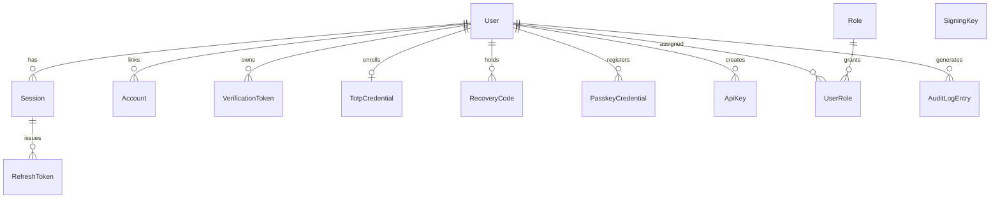

# Project Implementation Roadmap

**Project:** Better Auth–inspired authentication & authorization system — headless .NET 10 REST API
**Status:** Planning complete for approved decisions; items marked `Pending Decision` require project-owner approval before their workstream starts.
**Deliverable policy:** No UI. Controllers only (no minimal API endpoints). `Program.cs` is strictly a composition root. Better Auth is architectural inspiration only — no source code is copied.

---

## How to read this document

- Each numbered top-level section is one **workstream**. Workstreams are grouped into phases and ordered by dependency, not by the original requirement list order (the reordering is explained in [Workstream order rationale](#workstream-order-rationale)).
- **Approved** decisions were explicitly confirmed by the project owner and are final.
- **`Pending Decision`** items carry a recommendation but must not be treated as final until approved.
- Every task names concrete files or directories. A task that cannot name its output file is not specific enough and was rewritten until it could.

---

## Approved decisions (final)

| Area | Decision |
|---|---|
| Runtime | .NET 10 / ASP.NET Core 10, existing `net10.0` target |
| API style | RESTful, attribute-routed MVC controllers only; RFC 9457 Problem Details for all errors |
| Token strategy | JWT access tokens, **15-minute TTL**, signed **ES256** + opaque rotating refresh tokens (SHA-256 hashed at rest, single-use, bound to a session row, reuse detection revokes the session) |
| Session lifetime | **Sliding 6-hour inactivity window + 7-day absolute cap** (cap value approved 2026-07-22, P1 — ADR-0002) |
| Session model | **Multi-device**: one session row per login with device metadata (IP, user agent, created, last-active); list / revoke-one / revoke-all endpoints; **password change revokes all sessions** |
| Token transport | **Both**: `httpOnly` `Secure` cookies (with CSRF defense) for browser clients and `Authorization: Bearer` for mobile/CLI/server clients |
| Signing keys | ES256 with `kid`-based rotation and a public **JWKS** endpoint; rotation designed in from day one |
| User store | **Custom entities** (Better Auth–style schema). No ASP.NET Core Identity. ASP.NET Core `JwtBearer` middleware, custom authentication handlers, and policy-based authorization on top |
| Password hashing | **Argon2id** with parameters versioned inside the stored hash (enables re-hash-on-login migration) |
| v1 feature scope | Email/password + sessions + roles, **plus**: email verification, password reset, TOTP MFA + recovery codes, social login (OAuth/OIDC), API keys / personal access tokens, **passkeys (WebAuthn/FIDO2)** |
| Database | **PostgreSQL** (Npgsql EF Core provider); EF Core owns schema, relationships, indexes, migrations; `citext` for email columns |
| Validation | **FluentValidation** — one validator class per request DTO |
| Mapping | **Manual mapping extension methods** (AutoMapper rejected: commercial license, runtime opacity) |
| Logging | **Serilog** — structured logging, correlation-ID and user-ID enrichers, request logging |
| Testing | **xUnit** + `WebApplicationFactory` + **Testcontainers** (real PostgreSQL) for integration tests; unit tests for validators, services, token logic |
| Containers / CI | **Docker + docker-compose** (API + PostgreSQL + Mailpit) and **GitHub Actions** |
| API documentation | **Scalar** UI over the built-in OpenAPI generator + one Markdown file per endpoint under `Documentation/` |

## Pending Decisions (owner approval required)

**P1–P4 are resolved** (approved 2026-07-22). They are retained below for traceability; the decisions themselves now live in `Documentation/Decisions/`. **P5–P18 remain open.**

| # | Decision | Recommendation | Blocking workstream(s) |
|---|---|---|---|
| ~~P1~~ | Absolute session cap value | ✅ **Approved: 7 days** — `ADR-0002` | ~~4~~ resolved |
| ~~P2~~ | API versioning style | ✅ **Approved: URL segment `/api/v1/…`** via `Asp.Versioning.Mvc` — `ADR-0015` | ~~3, 11~~ resolved |
| ~~P3~~ | Additional directories beyond the mandated list | ✅ **Approved: all four** — `Validators/`, `Extensions/`, `Exceptions/`, `BackgroundServices/` — `ADR-0014` | ~~3~~ resolved |
| ~~P4~~ | Solution layout | ✅ **Approved: `src/Api/` + `tests/`**, root namespace `Api` — `ADR-0014` | ~~3~~ resolved |
| P5 | Caching | `HybridCache` in-memory first; Redis only when scaling to multiple nodes | 12, 17 |
| P6 | Rate-limiting store | Built-in ASP.NET Core `RateLimiter`, in-memory (single node); Redis-backed counters deferred with P5 | 17 |
| P7 | Secret management (prod) | Env vars now; vault target (Azure Key Vault / AWS SM / HashiCorp) chosen with deployment target | 25, 27 |
| P8 | Email provider (prod) | `IEmailSender` abstraction; Mailpit in dev; prod provider open | 12 |
| P9 | Background jobs | Plain `BackgroundService` for expired session/token cleanup; **no** Hangfire/Quartz in v1 | 12 |
| P10 | Observability backend | OpenTelemetry traces + metrics; export target open (OTLP-compatible) | 28 |
| P11 | Message broker | **None in v1.** No async cross-service communication exists; adding a broker would be speculative complexity | — |
| P12 | Initial social providers | Google + GitHub | 4, 12 |
| P13 | Social login flow style | SPA-driven PKCE code exchange vs API-driven redirect; recommend supporting API-driven redirect first | 4 |
| P14 | Deployment target | Open — entire §27 is pending | 27 |
| P15 | Load-testing tool | k6 | 23 |
| P16 | Scalar exposure in production | Dev + staging only; disabled in prod | 18 |
| P17 | Signing-key private-key storage at rest | DB rows encrypted via ASP.NET Core Data Protection; revisit with vault (P7) | 4, 27 |
| P18 | Audit log retention period | 90 days, then archive/delete via cleanup job | 15 |

**Explicitly out of v1 scope** (owner did not select; documented as future work in §29): organizations / multi-tenancy, machine-to-machine client-credentials flow. The full in-scope/out-of-scope statement now lives in `Documentation/Scope.md` (§1).

---

## Target directory structure

**Approved 2026-07-22** (P3 and P4 — see `Documentation/Decisions/ADR-0014-solution-layout-and-directories.md`). All four proposed directories are approved and the `src/` + `tests/` layout is confirmed; §3 performs the move. Root namespace becomes `Api`.

```text
dotnet-web-api-startpack/
├── src/
│   └── Api/                              # the existing project, moved (P4)
│       ├── Attributes/                   # [RequirePermission], [Idempotent], marker attributes
│       ├── BackgroundServices/           # APPROVED (P3): expired-session/token cleanup workers
│       ├── Configuration/                # typed options classes (JwtOptions, SessionOptions, …)
│       ├── Controllers/                  # one controller per resource/responsibility
│       ├── Data/
│       │   ├── Configurations/           # one IEntityTypeConfiguration<T> per entity
│       │   ├── Migrations/               # EF Core migrations
│       │   └── Seeding/                  # role seed data, dev-only user seeder
│       ├── DTOs/                         # per-feature request/response records
│       ├── Exceptions/                   # APPROVED (P3): domain exception types
│       ├── Extensions/                   # APPROVED (P3): composition-root extension methods
│       ├── Filters/                      # validation filter, audit action filter
│       ├── Handlers/                     # authentication + authorization handlers
│       ├── Helpers/                      # small static utilities (Base64Url, device parsing)
│       ├── Logging/                      # Serilog setup + enrichers
│       ├── Mappings/                     # manual entity↔DTO mapping extensions, per feature
│       ├── Middleware/                   # correlation ID, security headers, exception handling
│       ├── Models/                       # one file per entity
│       ├── Properties/                   # launchSettings.json
│       ├── Services/                     # per-feature service interfaces + implementations
│       ├── Validators/                   # APPROVED (P3): one FluentValidation validator per request DTO
│       ├── wwwroot/                      # static assets (kept minimal; .gitkeep)
│       └── Program.cs                    # composition root only
├── tests/
│   ├── UnitTests/
│   └── IntegrationTests/
├── Documentation/                        # per-endpoint Markdown (structure in §19)
├── docker-compose.yml
├── Dockerfile                            # lives next to src/Api or at root (multi-stage)
├── .github/workflows/ci.yml
├── ROADMAP.md
└── dotnet-web-api-startpack.sln
```

**Justification for the four approved additions (P3 — recorded in `ADR-0014`):**

- `Validators/` — FluentValidation is approved; one validator class per request DTO is mandated by the modularity rules. Placing validators inside `DTOs/` would mix two responsibilities in one tree; a sibling directory mirroring the `DTOs/<Feature>/` layout keeps both discoverable.
- `Extensions/` — `Program.cs` may only call modular extension methods. Those methods (`AddApiServices`, `AddAuthenticationSetup`, `UseApiPipeline`, …) need a home; `Configuration/` is reserved for options classes.
- `Exceptions/` — services signal failures with typed domain exceptions (`EmailAlreadyRegisteredException`, `TokenReuseDetectedException`, …) translated centrally to Problem Details. One class per file requires a directory.
- `BackgroundServices/` — expired-session/token cleanup (P9) is neither a service called by controllers nor middleware; hosted workers deserve their own directory.

---

## Entity model (13 entities)



| Entity | Purpose | Key fields (beyond id/timestamps) |
|---|---|---|
| `User` | Account principal | `Email` (citext, unique), `EmailVerified`, `PasswordHash` (nullable — social/passkey-only users), `LockoutEndsAt`, `FailedLoginCount`, `SecurityStamp` |
| `Session` | One login on one device | `UserId`, `IpAddress`, `UserAgent`, `DeviceLabel`, `LastActiveAt`, `AbsoluteExpiresAt`, `RevokedAt`, `RevocationReason` |
| `RefreshToken` | Rotating opaque token | `SessionId`, `TokenHash` (SHA-256, unique), `ExpiresAt`, `UsedAt`, `ReplacedByTokenId` |
| `Account` | External identity link | `UserId`, `Provider`, `ProviderAccountId` (unique per provider) |
| `VerificationToken` | Email-verify + password-reset tokens | `UserId`, `Type` (enum), `TokenHash`, `ExpiresAt`, `ConsumedAt` |
| `TotpCredential` | MFA authenticator secret | `UserId` (unique), `SecretEncrypted`, `ConfirmedAt` |
| `RecoveryCode` | MFA fallback | `UserId`, `CodeHash`, `UsedAt` |
| `PasskeyCredential` | WebAuthn credential | `UserId`, `CredentialId` (unique), `PublicKey`, `SignCount`, `Aaguid`, `Transports`, `Label` |
| `ApiKey` | Programmatic access | `UserId`, `KeyPrefix` (lookup), `KeyHash`, `Scopes`, `ExpiresAt`, `LastUsedAt`, `RevokedAt` |
| `Role` | Authorization role | `Name` (unique), `Description` |
| `UserRole` | Join table | `UserId` + `RoleId` composite key |
| `AuditLogEntry` | Security audit trail | `UserId` (nullable), `EventType`, `IpAddress`, `UserAgent`, `CorrelationId`, `Metadata` (jsonb) |
| `SigningKey` | ES256 key ring | `KeyId` (kid), `PrivateKeyProtected`, `PublicKey`, `Status` (Active/Retiring/Retired), `ActivatedAt`, `RetiredAt` |

Permissions are **code constants** mapped to roles in a static policy map (not DB rows) in v1 — keeps the schema lean; DB-driven permissions are listed as future work (§29).

---

## Endpoint inventory

Drives the controller split (§11) and the `Documentation/` file list (§19). All routes below use URL-segment versioning (P2 approved — `ADR-0015`). Auth column: 🔓 anonymous, 🔐 authenticated, 👑 admin role.

| Method | Route | Auth | Controller |
|---|---|---|---|
| POST | `/api/v1/auth/register` | 🔓 | `AuthController` |
| POST | `/api/v1/auth/login` | 🔓 | `AuthController` |
| POST | `/api/v1/auth/login/mfa` | 🔓 (MFA ticket) | `AuthController` |
| POST | `/api/v1/auth/refresh` | 🔓 (refresh token) | `AuthController` |
| POST | `/api/v1/auth/logout` | 🔐 | `AuthController` |
| GET | `/api/v1/auth/csrf` | 🔓 | `AuthController` |
| GET | `/api/v1/auth/social/{provider}/authorize` | 🔓 | `SocialAuthController` |
| GET | `/api/v1/auth/social/{provider}/callback` | 🔓 | `SocialAuthController` |
| GET | `/api/v1/sessions` | 🔐 | `SessionsController` |
| DELETE | `/api/v1/sessions/{sessionId}` | 🔐 | `SessionsController` |
| DELETE | `/api/v1/sessions` | 🔐 | `SessionsController` (revoke all except current) |
| POST | `/api/v1/email-verification/send` | 🔐 | `EmailVerificationController` |
| POST | `/api/v1/email-verification/confirm` | 🔓 | `EmailVerificationController` |
| POST | `/api/v1/password-reset/request` | 🔓 | `PasswordResetController` |
| POST | `/api/v1/password-reset/confirm` | 🔓 | `PasswordResetController` |
| POST | `/api/v1/mfa/totp/enroll` | 🔐 | `MfaController` |
| POST | `/api/v1/mfa/totp/confirm` | 🔐 | `MfaController` |
| DELETE | `/api/v1/mfa/totp` | 🔐 (recent auth) | `MfaController` |
| POST | `/api/v1/mfa/recovery-codes/regenerate` | 🔐 (recent auth) | `MfaController` |
| POST | `/api/v1/passkeys/registration/options` | 🔐 | `PasskeysController` |
| POST | `/api/v1/passkeys/registration/complete` | 🔐 | `PasskeysController` |
| POST | `/api/v1/passkeys/authentication/options` | 🔓 | `PasskeysController` |
| POST | `/api/v1/passkeys/authentication/complete` | 🔓 | `PasskeysController` |
| GET | `/api/v1/passkeys` | 🔐 | `PasskeysController` |
| DELETE | `/api/v1/passkeys/{credentialId}` | 🔐 | `PasskeysController` |
| POST | `/api/v1/api-keys` | 🔐 | `ApiKeysController` |
| GET | `/api/v1/api-keys` | 🔐 | `ApiKeysController` |
| DELETE | `/api/v1/api-keys/{keyId}` | 🔐 | `ApiKeysController` |
| GET | `/api/v1/users/me` | 🔐 | `UsersController` |
| PATCH | `/api/v1/users/me` | 🔐 | `UsersController` |
| DELETE | `/api/v1/users/me` | 🔐 (recent auth) | `UsersController` |
| PUT | `/api/v1/users/me/password` | 🔐 | `UsersController` (revokes all sessions) |
| GET | `/api/v1/users/me/accounts` | 🔐 | `UsersController` |
| DELETE | `/api/v1/users/me/accounts/{accountId}` | 🔐 | `UsersController` |
| GET | `/api/v1/admin/users` | 👑 | `AdminUsersController` (paged/filter/sort) |
| GET | `/api/v1/admin/users/{userId}` | 👑 | `AdminUsersController` |
| PATCH | `/api/v1/admin/users/{userId}` | 👑 | `AdminUsersController` |
| DELETE | `/api/v1/admin/users/{userId}` | 👑 | `AdminUsersController` |
| POST | `/api/v1/admin/users/{userId}/roles` | 👑 | `AdminUserRolesController` |
| DELETE | `/api/v1/admin/users/{userId}/roles/{roleId}` | 👑 | `AdminUserRolesController` |
| DELETE | `/api/v1/admin/users/{userId}/sessions` | 👑 | `AdminUserSessionsController` |
| GET | `/api/v1/admin/audit-logs` | 👑 | `AdminAuditLogsController` (paged/filter) |
| GET | `/.well-known/jwks.json` | 🔓 | `WellKnownController` (unversioned) |
| GET | `/health/live`, `/health/ready` | 🔓 | health-check middleware (unversioned) |

---

## Phase overview and workstream order rationale

| Phase | Workstreams | Theme |
|---|---|---|
| A — Foundation | 1, 2, 3 | Decisions, stack, skeleton |
| B — Architecture | 4, 5 | Token + authorization design |
| C — Data | 6, 7, 8 | Entities, EF Core, migrations |
| D — API plumbing | 9, 10, 11, 12, 13, 14 | DTOs, validation, controllers, services, standards, middleware |
| E — Cross-cutting | 15, 16, 17 | Logging/audit, hardening, rate limiting |
| F — Documentation | 18, 19 | Scalar/OpenAPI, endpoint Markdown |
| G — Testing | 20, 21, 22, 23 | Unit, integration, security, load |
| H — Operations | 24, 25, 26, 27, 28 | Docker, config, CI/CD, deployment, monitoring |
| I — Longevity | 29 | Maintenance, extensibility |

**Workstream order rationale**: the original requirement list places authentication architecture (its #3) before solution structure (its #5). This roadmap swaps them: the solution skeleton, directories, and composition-root pattern must exist before architecture components have anywhere to land, and the token design (§4) must precede entity modeling (§6) because the `Session`/`RefreshToken`/`SigningKey` schemas are direct outputs of it. All 29 required workstreams are present; none are omitted. Feature implementation (register → login → refresh → sessions → verification/reset → MFA → social → passkeys → API keys → admin) is not a separate workstream — each feature slice cuts through §9–§15 and §19–§22, and the recommended build order is listed in §11.

---
